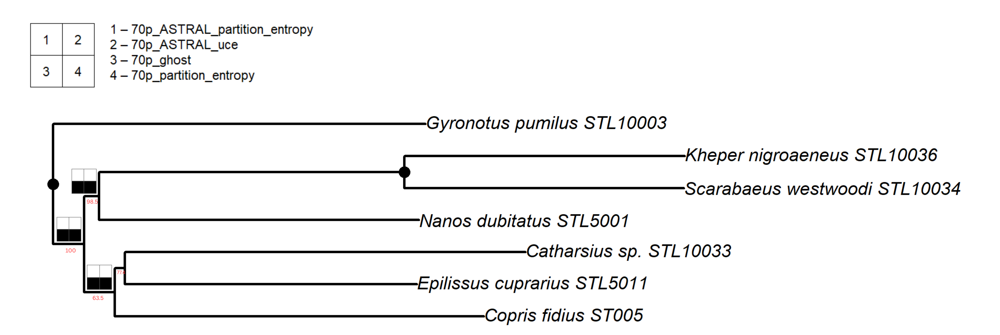
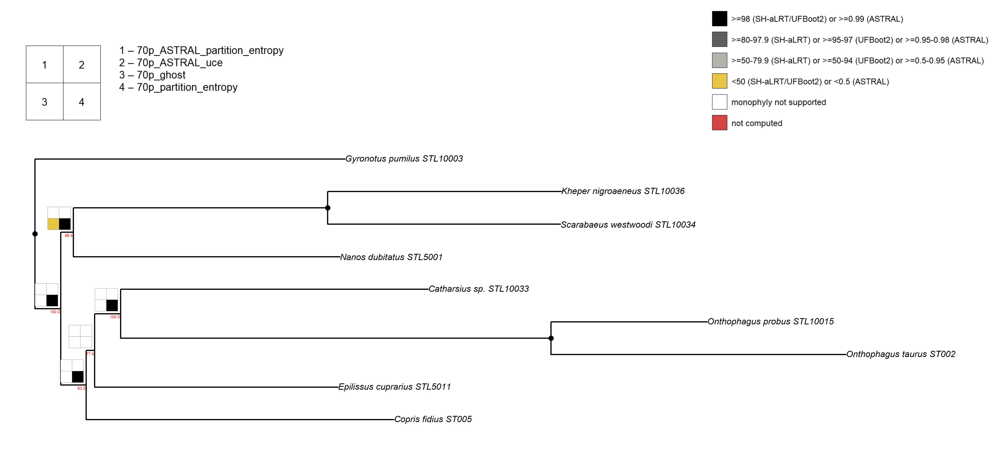

<!-- README.md is generated from README.Rmd. Please edit that file -->

```{r, include = FALSE}
knitr::opts_chunk$set(
  collapse = TRUE,
  comment = "#>",
  fig.path = "man/figures/README-",
  out.width = "100%"
)
```

# phylorug 

<!-- badges: start -->

[](https://github.com/mdrifathahamed/phylorug/actions/workflows/R-CMD-check.yaml) [](https://opensource.org/licenses/MIT) [](https://www.repostatus.org/#wip) [](https://app.codecov.io/gh/mdrifathahamed/phylorug)

<!-- badges: end -->

------------------------------------------------------------------------

## Overview

Phylogenetic trees now routinely include hundreds or thousands of taxa, and as sequencing technologies become cheaper and datasets grow, trees will only get larger. Additionally, modern phylogenomic studies routinely produce multiple species trees for the same underlying hypothesis. Researchers combine different data types (morphology, UCEs, transcriptomes, whole genomes), apply different analytical strategies (concatenation with varying partitioning schemes, coalescent methods, site-heterogeneous models), use different alignment approaches, and employ different inference software (IQ-TREE, ASTRAL, MrBayes, RAxML). Each combination yields a tree with its own support values in its own format, such as ultrafast bootstrap, SH-aLRT, posterior probability, and local posterior probability, and the central question becomes: which nodes hold up across methods, and how strongly?

The rug plot concept for comparing clade recovery across analytical conditions was introduced by Wheeler (1995) and popularized as "Navajo rugs" by Giribet (2003). Software to automate these plots, Cladescan (Sanders 2010) and YBYRÁ (Machado 2015), both of which are no longer maintained, were designed for parsimony parameter sensitivity rather than modern multi-method phylogenomic comparison. No existing tool maps heterogeneous support values from multiple inference pipelines onto a single tree within R.

**phylorug** maps clade recovery and support values from any number of independently inferred phylogenetic trees onto a single reference topology as a rug plot. It operates in two modes:

## Presence mode

Black/white cells showing whether each tree recovers a given clade (the direct descendant of Wheeler's space plots, but phylorug is not limited to parameters)

## Support Mode

 Black, grey, yellow, white, and red cells showing how strongly each analysis supports a given clade, with automatic normalization across heterogeneous support formats.

The entire workflow runs in R, from reading raw tree files to publication-ready figures. No manual placement, no external software , just a few extra lines in your existing phylogenetic script. The package was developed on a 316-taxon dung beetle phylogenomic dataset (Lopes et al. 2024) and tested with simulated trees of over 700 taxa across 15 analyses. Three real-world datasets are bundled so users can explore the pipeline before applying it to their own data.

### Installation

**phylorug** is not yet on CRAN. To install the development version from GitHub:

``` r
# install.packages("devtools")
devtools::install_github("mdrifathahamed/phylorug")
library(phylorug)
```

### Quick example

``` r
library(phylorug)

# Load bundled example trees
data(sample_trees)

# Select backbone and comparison trees
backbone <- sample_trees[["70p_uce"]]
others   <- sample_trees[names(sample_trees) != "70p_uce"]

# Validate shared taxa
check_taxa(backbone, others)

# Build the node presence matrix
npm <- node_presence_matrix(backbone, others)

# Presence mode — which analyses recover each clade?
plot_phylorug(backbone, npm, mode = "presence")

# Support mode — how strongly?
plot_phylorug(backbone, npm, mode = "support",
              support_type = c(
                "70p_ASTRAL_partition_entropy" = "lpp",
                "70p_ASTRAL_uce"               = "lpp",
                "70p_ghost"                    = "ufboot",
                "70p_partition_entropy"        = "ufboot"
              ))
```

### Core functions

**phylorug** provides six functions that cover the full workflow from raw tree files to publication-ready figures:

- `read_trees()` reads all Newick and Nexus tree files from a single directory in one call. So you dont need to load each file individually.
- `check_taxa()` validates that the backbone and comparison trees share the same taxa, reporting any missing or extra tips.
- `node_presence_matrix()` builds the comparison matrix recording which clades are recovered by which analyses, along with their support values.
- `plot_phylorug()` draws the rug plot on a reference tree in presence or support mode, with automatic normalization of heterogeneous support formats.

That is the basic pipeline: read → check → matrix → plot. Two additional helpers are available when your data needs them:

- `translate_tips()` maps tip labels between naming conventions using a lookup table (e.g. specimen codes to species names).
- `prune_to_shared()` prunes all trees to their shared taxon set when overlap is incomplete.

You can learn more about each step in `vignette("phylorug")`.

### Dependencies

**phylorug** depends on [ape](https://cran.r-project.org/package=ape) and [phangorn](https://cran.r-project.org/package=phangorn). No other external dependencies are required.

### Additional features

- Handles compound IQ-TREE labels (e.g. `SH-aLRT/UFBoot2`) automatically
- Treats a bare `multiPhylo` as one analysis (a pool of tied-optimal trees)
- Explicit errors over silent failures throughout

### Getting help

An overview of the package: `?phylorug`

If you find a bug or have a feature request, please open an issue on [GitHub](https://github.com/mdrifathahamed/phylorug/issues).

### Citation

If you use **phylorug** in a publication, please cite:

> Ahamed, M.R., Tarasov, S., and Arias, J.S. (2026). phylorug: Visualize Clade Recovery and Support Across Phylogenetic Trees. R package version 0.1.0. <https://github.com/mdrifathahamed/phylorug>

### Acknowledgements

This package was developed at the [Finnish Museum of Natural History (LUOMUS)](https://www.luomus.fi/en), University of Helsinki, as part of an MSc thesis in Ecology and Evolutionary Biology under the supervision of Dr. Sergei Tarasov.

The rug-plot concept for phylogenetic sensitivity analysis traces to Wheeler (1995), was formalized by Giribet (2003), and automated by Sanders (2010, Cladescan) and Machado (2015, YBYRÁ).
