# Introduction to phylorug

## What problem does phylorug solve?

Modern phylogenomic studies routinely produce multiple trees from the
same set of taxa. Different data types (UCEs, transcriptomes, whole
genomes), different analytical strategies (concatenation, coalescent
methods, site-heterogeneous models), and different inference software
(IQ-TREE, ASTRAL, MrBayes) each yield a tree with slightly different
topology and its own support values in its own format. At the same time,
no single tree inference method is proven to be the all-rounder.

Incomplete lineage sorting, long-branch attraction, model
misspecification, and compositional heterogeneity each affect different
methods differently (Fleming et al. 2023). Accordingly, exploring
multiple strategies , on different data types and different inference
pipelines is the way researchers detect nodes that may be artifacts of a
particular analytical choice versus nodes that hold up regardless of
method.

The question at every node is:

Does this clade appear in all analyses, and how strongly does each one
support it?

Answering that by flipping between tree files is tedious, error-prone,
and is very time-consuming with bigger trees. **phylorug** solves it by
drawing a compact coloured grid a **rug plot** at every internal node of
a reference tree(backbone). Each cell represents one tree, its colour
shows whether that tree recovered the clade and how strongly it
supported it.

## Nodal support versus nodal stability

Giribet (2003) drew a distinction that motivates the two modes of
phylorug. **Nodal support** measures how confident a single analysis is
in a clade such as bootstrap, posterior probability, or LPP. **Nodal
stability** measures whether that clade is consistently recovered across
different analytical strategies, data types, and inference methods,
extending Wheeler’s (1995) parameter-space sensitivity analysis
framework. These can decouple: a clade may receive 100% bootstrap under
one model yet collapse under all others, or carry only 30–50% support
everywhere yet appear in every tree.

phylorug shows both. In `presence` mode, each node gets a black dot if
every analysis recovers the clade (stable), or a rug showing which
analyses recover it and which do not.

`support` mode builds on it, keeps the same presence/absence information
but adds how strongly each analysis supports the clade, shading each
cell by its support value instead of just marking it filled or empty.
Stable nodes still get a black dot by default. Setting
`rug_on_identical = TRUE` extends the rug to these nodes too. It is
useful in support mode, since it shows whether a clade recovered by
every analysis is actually supported equally strongly by all of them.

### Brief history

The rug plot concept originated with Wheeler (1995), who plotted clade
recovery across gap and transversion–transition cost ratios in parsimony
analysis. Giribet (2003) named these plots “Navajo rugs” and showed that
nodal support and nodal stability can tell different stories.

Sanders (2010) automated parameter-space sensitivity analysis with
Cladescan (Perl), and Machado (2015) extended the approach with YBYRÁ
(Python). Both tools produce individual SVG plots per node that must be
manually placed onto the tree in a vector editor. Cladescan is no longer
available online, and YBYRÁ has been archived by its developer and is no
longer maintained. More importantly, both were designed around
sensitivity analysis within a single analytical framework, varying
parameters and cost schemes, rather than comparing trees from
fundamentally different inference pipelines that report support in
incompatible formats (e.g.,UFBoot2, SH-aLRT, posterior probability,
ASTRAL LPP).

phylorug extends this lineage into R. It reads trees from any pipeline,
bins support values against thresholds built for their own metric
instead of rescaling everything onto one numeric scale, and draws the
rug directly on the reference tree, no manual placement, no outside
software.

## Quick start

The fastest way to see phylorug in action is with the built-in
`sample_trees` dataset, a 15-taxon subset of the beetle data (Montanaro,
Lopes et al., 2026), already rooted, pruned, and with tip labels
translated to scientific names. Lets start with attaching the package :

``` r

library(phylorug)
```

### Load the data

`sample_trees` is a named list of five `phylo` objects, all sharing the
same 15 taxa. Pick one as the backbone and use the rest as comparisons.
In the original study `70p_uce` is used as a backbone tree.

``` r

names(sample_trees)
#> [1] "70p_ASTRAL_partition_entropy" "70p_ASTRAL_uce"              
#> [3] "70p_ghost"                    "70p_partition_entropy"       
#> [5] "70p_uce"

backbone <- sample_trees[["70p_uce"]]
others   <- sample_trees[names(sample_trees) != "70p_uce"]
```

### Check taxon consistency

[`check_taxa()`](https://mdrifathahamed.github.io/phylorug/reference/check_taxa.md)
compares the tip labels of the backbone against every comparison tree
and reports any mismatches, missing taxa, extra taxa, or spelling
differences. Running it before
[`node_presence_matrix()`](https://mdrifathahamed.github.io/phylorug/reference/node_presence_matrix.md)
is good practice, especially the first time you work with a new dataset.
That said,
[`node_presence_matrix()`](https://mdrifathahamed.github.io/phylorug/reference/node_presence_matrix.md)
will stop with a clear error if a comparison tree is missing a backbone
taxon, so if you already know your trees share the same taxa you can
skip straight to building the matrix :

``` r

check_taxa(backbone, others)
#> All 4 comparison trees share the same 15 taxa as the backbone.
#> [1] TRUE
#> attr(,"diagnostics")
#>                     comparison    status n_taxa missing extra
#> 1 70p_ASTRAL_partition_entropy identical     15              
#> 2               70p_ASTRAL_uce identical     15              
#> 3                    70p_ghost identical     15              
#> 4        70p_partition_entropy identical     15
```

All trees share the same 15 taxa, so we can proceed. If a mismatch is
reported the helper function
[`prune_to_shared()`](https://mdrifathahamed.github.io/phylorug/reference/prune_to_shared.md)
can be used to get identical taxa set.

### Build the node presence matrix

Now this is the core computing function of `phylorug`, the next question
is which clades from the backbone show up in which comparison trees, and
how strongly each one is supported.
[`node_presence_matrix()`](https://mdrifathahamed.github.io/phylorug/reference/node_presence_matrix.md)
answers this by walking every internal node of the backbone and checking
each comparison tree for that same clade.

It returns a named list: a **presence matrix** (1 = clade recovered, 0 =
absent), plus one or more **support matrices** holding the support
values pulled from each tree’s node labels. By default it reads the
first value in each label. If your trees carry compound labels like
`100/98` (SH-aLRT/UFBoot2 from IQ-TREE, for example), `support_col`
picks which one to use `support_col = 1` for the first,
`support_col = 2` for the second, or `support_col = c(1, 2)` to pull
both at once and makes two **support matrices**.

Two more arguments belong here. `support_type` is a named character
vector telling
[`node_presence_matrix()`](https://mdrifathahamed.github.io/phylorug/reference/node_presence_matrix.md)
which support metric each comparison tree uses (`"ufboot"`, `"lpp"`,
`"sh_alrt"`, `"posterior"`). It gets stored with the result and
[`plot_phylorug()`](https://mdrifathahamed.github.io/phylorug/reference/plot_phylorug.md)
reads it automatically in support mode, so you only declare it once,
here.

`pool_threshold` matters when a comparison tree file holds several
equally optimal trees (a pool) instead of one. It sets how many of them
need to recover a clade before it counts as present: `1.0` (the default)
a strict consensus; `0.5` needs just a majority; `0` skips the cutoff
entirely and records the raw fraction that recovered it. `sample_trees`
is all single `phylo` objects, no pools, so `pool_threshold` doesn’t
come into play here.

We declare `support_type` now so
[`plot_phylorug()`](https://mdrifathahamed.github.io/phylorug/reference/plot_phylorug.md)
can bin each tree’s support values against the right thresholds for its
own metric:

``` r

support_type <- c(
  "70p_ASTRAL_partition_entropy" = "lpp",
  "70p_ASTRAL_uce"               = "lpp",
  "70p_ghost"                    = "ufboot",
  "70p_partition_entropy"        = "ufboot"
)
```

``` r

npm <- node_presence_matrix(backbone, others, support_col = c(1, 2), support_type = support_type)
```

The result is a named list. `npm$presence` is a matrix of 1s and 0s.
`npm$support_1` and `npm$support_2` hold the raw support values, with
`NA` where the clade was not recovered. These matrices are what
[`plot_phylorug()`](https://mdrifathahamed.github.io/phylorug/reference/plot_phylorug.md)
uses to draw the rug, presence determines whether a cell is filled or
empty, support determines its shade.

### Plot the rug

With the node presence matrix ready,
[`plot_phylorug()`](https://mdrifathahamed.github.io/phylorug/reference/plot_phylorug.md)
draws the rug on the backbone. In its simplest form, all arguments are
defaults: `mode = "presence"`, `dot_identical = TRUE` (unanimous nodes
get a black dot), `legend = TRUE`, and `rug_position = "inside"`. The
internal scaling engine sizes the canvas, fonts, and cell dimensions
automatically based on tree size.

``` r

plot_phylorug(backbone, npm)
```

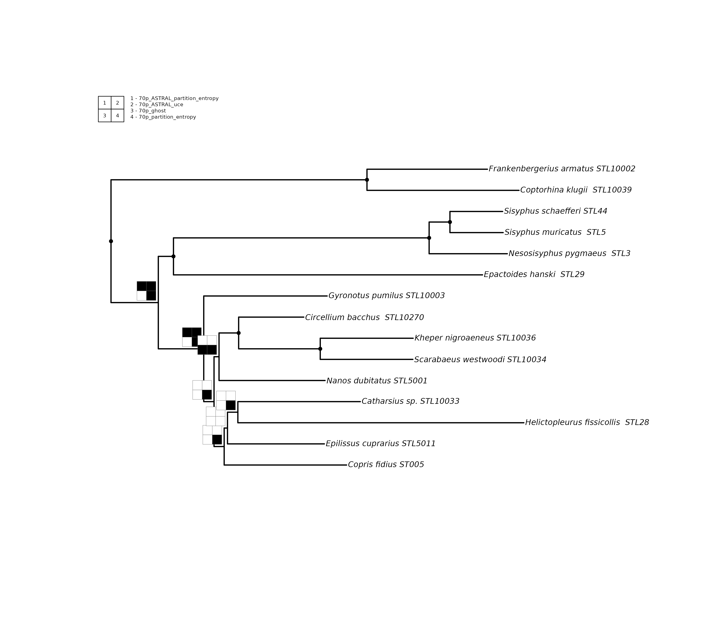

For publication-quality output, setting `file`, `width`, and `height` is
strongly recommended. All other arguments are worth exploring to
fine-tune your figure, but these three matter most.

``` r

plot_phylorug(backbone, npm, file = "presence.pdf", width = 12, height = 8)
```

### Support mode

Now switch to support mode to see how strongly each tree supports each
clade. Cells are shaded by binned support strength, darker means
stronger. Support values are binned against thresholds specific to their
own metric: a tree with LPP 0.95 and a tree with LPP 0.65 are compared
to LPP thresholds, while a tree carrying UFBoot2 values is binned
against UFBoot2 thresholds independently. phylorug never cross-compares
values from different support metrics, because LPP 0.95 and UFBoot2 95
do not measure the same thing despite looking numerically similar.

Since we already declared `support_type` when building the node presence
matrix,
[`plot_phylorug()`](https://mdrifathahamed.github.io/phylorug/reference/plot_phylorug.md)
reads it automatically from the stored attribute and applies the correct
metric-specific thresholds.

If `support_type` is not declared,
[`plot_phylorug()`](https://mdrifathahamed.github.io/phylorug/reference/plot_phylorug.md)
falls back to a universal threshold scale: values greater than 1 are
divided by 100 to bring them onto a 0–1 scale, and all trees are binned
against the same set of thresholds regardless of metric. This is a
reasonable starting point for quick exploration, but declaring
`support_type` is always preferred because it ensures each value is
evaluated against the thresholds published for its own method.

``` r

plot_phylorug(
  backbone, npm,
  mode         = "support")
```

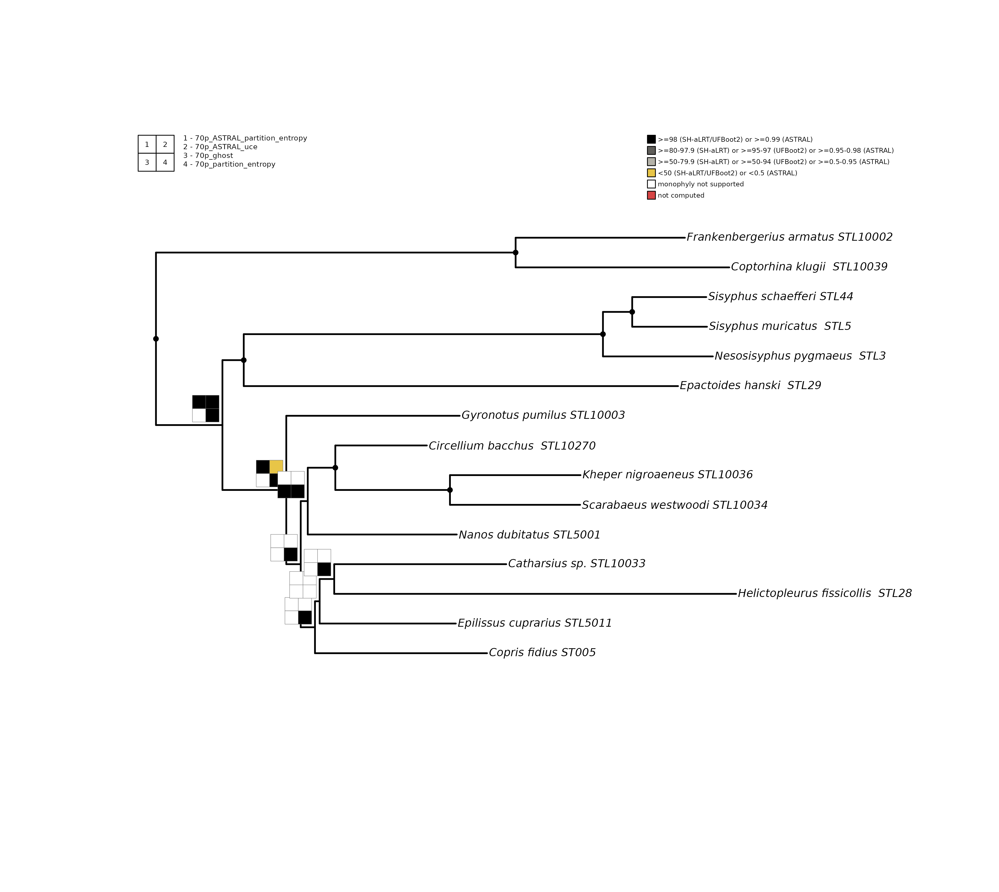

## Reading the rug plot

The rug plot carries two legends. The **position legend** (top-left)
maps each numbered cell to a tree. For example, cell 1 is the first
tree, cell 2 the second, and so on. The **threshold legend** (top-right,
support mode only) shows what each shade means.

At each node you will see one of these patterns:

- **Black dot**: all analyses recover this clade unanimously
  (`dot_identical = TRUE`, the default). No rug is drawn to reduce
  clutter.
- **Mixed grid**: some cells filled with solid black, some white. These
  are the interesting nodes, the position legend tells you which
  analysis agrees and which disagrees.
- **Bare node** (no dot, no rug): no comparison tree recovers this
  backbone clade, it exists only in the backbone topology. This is the
  default behaviour (`hide_unsupported = TRUE`). Set
  `hide_unsupported = FALSE` to draw all-white grids at these nodes
  instead.

In support mode, filled cells are shaded by how strongly each analysis
supports the clade. The colour scheme uses a greyscale gradient for
recovered clades plus two special colours for absent and unparseable
cases. The thresholds shown below are the package defaults. Different
fields and journals apply different cutoffs, so we recommend defining
your own via the `thresholds` argument (see the Customisation section
below):

- **Black**: very high support (UFBoot2 \>= 95, SH-aLRT \>= 80, LPP
  \>=0.95).
- **Dark grey**: high support (UFBoot2 80-94, SH-aLRT 70-79, LPP
  0.90-0.94).
- **Light grey**: moderate support (UFBoot2 50-79, SH-aLRT 50-69, LPP
  0.50-0.89).
- **Yellow**: low support (below 50 for UFBoot2/SH-aLRT, below 0.50 for
  LPP). Present but weakly endorsed.
- **White**: clade not recovered by that analysis.
- **Red**: clade recovered but no support value could be read. This
  typically means the tree file had no node labels, or the label was not
  a parseable number.

## Fine-tuning the figure

The following example shows how optional arguments refine the plot.
`rug_on_identical = TRUE` extends the rug to unanimous nodes, revealing
per-tree support strength even at stable clades.
`hide_unsupported = FALSE` would draw all-white rugs at nodes unique to
the backbone; the default (`TRUE`) leaves them bare. `cell_scale`
adjusts the size of each rug cell, `rug_position` controls whether rugs
sit toward the root (`"inside"`) or toward the tips (`"outside"`).
`dot_cex` scales the unanimous-node dot, and `show_support = TRUE` with
`support_label_cex` and `support_label_col` overlays the backbone’s own
support labels on the tree. `cex` and `font` are passed directly to the
tree plotter. For publication output, add `file = "output.pdf"` along
with `width` and `height` to produce a properly scaled figure.

``` r

# For publication output, add:
# file = "my_support_plot.pdf"
plot_phylorug(
  backbone, npm,
  width             = 6.5,
  height            = 5.8,
  mode              = "support",
  rug_position      = "inside",
  cell_scale        = 0.38,
  rug_on_identical  = TRUE,
  cex               = 0.90,
  font              = 3,
  dot_cex           = 1.3,
  show_support      = TRUE,
  support_label_col = "red",
  support_label_cex = 0.4
)
```

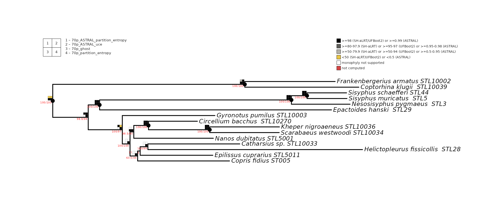

## Working with real data: Culicomorpha

The built-in Culicomorpha dataset contains 10 phylogenomic analyses of
46 taxa from eight Diptera families (Fu et al., 2025), covering IQ-TREE
partitioned, PMSF, LG+C20+F+R, and ASTRAL strategies.

### Read the trees

[`read_trees()`](https://mdrifathahamed.github.io/phylorug/reference/read_trees.md)
scans a directory for tree files and returns a named list:

``` r

tree_dir <- system.file("extdata", "culicomorpha", package = "phylorug")
trees    <- read_trees(tree_dir)
#> Read 10 analyses (10 trees) from: /home/runner/work/_temp/Library/phylorug/extdata/culicomorpha
names(trees)
#>  [1] "Matrix1_LG_C20_F_R"           "Matrix1-kpi_ASTRAL"          
#>  [3] "Matrix1-kpi_partitioning"     "Matrix1-kpi_PMSF(H1.guide)"  
#>  [5] "Matrix1-kpi_PMSF(H2.guide)"   "Matrix1-smart_ASTRAL"        
#>  [7] "Matrix1-smart_partitioning"   "Matrix1-smart_PMSF(H1.guide)"
#>  [9] "Matrix1-smart_PMSF(H2.guide)" "Matrix2_partitioning"
```

### Root and remove the outgroups

The *Culicomorpha* trees include three outgroup taxa from outside the
infraorder: *Phlebotomus chinensis* and *Clogmia albipunctata
(Psychodidae)* and *Coboldia fuscipes (Scatopsidae)*. Root on all three,
then drop them. The order matters, you must root while the outgroup tips
are still present, because
[`ape::root()`](https://rdrr.io/pkg/ape/man/root.html) needs to find
them in the tree:

``` r

trees <- lapply(trees, function(tr) {
  tr <- ape::root(tr, outgroup = c("Coboldia_fuscipes",
                                   "Phlebotomus_chinensis",
                                   "Clogmia_albipunctata"),
                  resolve.root = TRUE)
  ape::drop.tip(tr, c("Coboldia_fuscipes",
                      "Phlebotomus_chinensis",
                      "Clogmia_albipunctata"))
})
```

The Culicomorpha trees already carry species names as tip labels, so no
translation is needed here. For trees with specimen codes, see
[`translate_tips()`](https://mdrifathahamed.github.io/phylorug/reference/translate_tips.md)
in the beetles example below.

### Choose a backbone

Pick one analysis as the backbone. The remaining trees are comparisons:

``` r

backbone <- trees[["Matrix1-kpi_PMSF(H1.guide)"]]
others   <- trees[names(trees) != "Matrix1-kpi_PMSF(H1.guide)"]
```

### Check taxon consistency

``` r

check_taxa(backbone, others)
#> All 9 comparison trees share the same 43 taxa as the backbone.
#> [1] TRUE
#> attr(,"diagnostics")
#>                     comparison    status n_taxa missing extra
#> 1           Matrix1_LG_C20_F_R identical     43              
#> 2           Matrix1-kpi_ASTRAL identical     43              
#> 3     Matrix1-kpi_partitioning identical     43              
#> 4   Matrix1-kpi_PMSF(H2.guide) identical     43              
#> 5         Matrix1-smart_ASTRAL identical     43              
#> 6   Matrix1-smart_partitioning identical     43              
#> 7 Matrix1-smart_PMSF(H1.guide) identical     43              
#> 8 Matrix1-smart_PMSF(H2.guide) identical     43              
#> 9         Matrix2_partitioning identical     43
```

### Build the matrix and plot

``` r

support_type <- c(
  "Matrix1-kpi_ASTRAL"            = "lpp",
  "Matrix1-smart_ASTRAL"          = "lpp",
  "Matrix1-kpi_partitioning"      = "sh_alrt",
  "Matrix1-kpi_PMSF(H2.guide)"    = "sh_alrt",
  "Matrix1_LG_C20_F_R"            = "sh_alrt",
  "Matrix1-smart_partitioning"    = "sh_alrt",
  "Matrix1-smart_PMSF(H1.guide)"  = "sh_alrt",
  "Matrix1-smart_PMSF(H2.guide)"  = "sh_alrt",
  "Matrix2_partitioning"          = "sh_alrt"
)
```

``` r

npm <- node_presence_matrix(backbone, others, support_type = support_type)
```

### plot the phylorug-presence

``` r

plot_phylorug(backbone, npm)
```

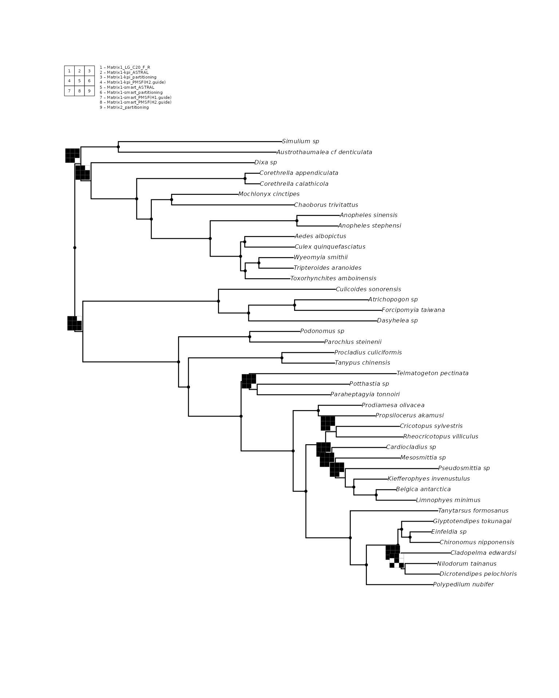

With 9 comparison trees, phylorug automatically arranges the rug grid (3
columns by 3 rows in this case). The position legend maps each cell
position to an analysis name.

### support-mode

Here we use `show_support = TRUE` to overlay the backbone’s own node
labels in red for cross-referencing and `cell_scale = 0.35` to shrink
the rug cells slightly for a denser tree. All-white rugs are hidden by
default, so only contested and stable nodes remain visible.

``` r

plot_phylorug(backbone, npm,
              mode               = "support",
              show_support       = TRUE,
              support_label_cex  = 0.25,
              support_label_col  = "red",
              cell_scale         = 0.35,
              rug_position       = "inside",
              rug_on_identical   = FALSE)
```

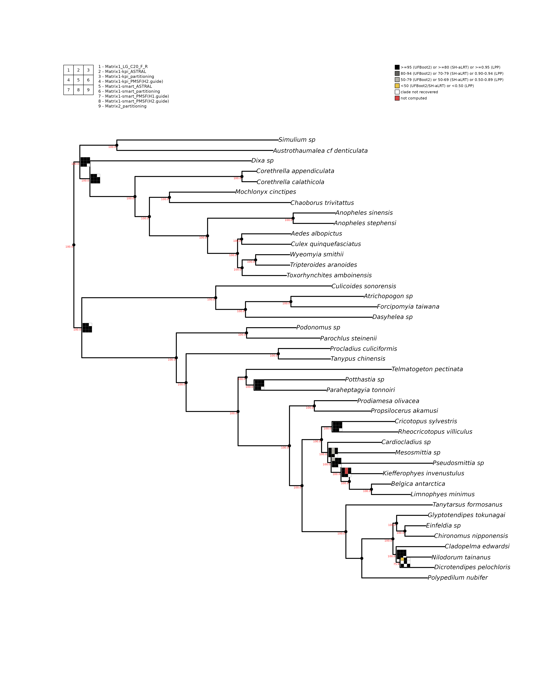

### What the rug reveals?

The **rugs** immediately separates stable from contested regions of the
*Culicomorpha* tree. Most family-level clades carry black dots, meaning
those clades are recovered by unanimously all analyses. *Culicidae*
(mosquitoes), *Chironomidae* (non-biting midges), *Ceratopogonidae*
(biting midges), and the *Simuliidae* + *Thaumaleidae* clade all show
complete agreement across every inference method and dataset. Fu et al.
(2025) reported the same, full support for these clades regardless of
model or matrix.

The interesting nodes are the contested ones. The central question in
*Culicomorpha* phylogenetics is where *Ceratopogonidae* and
*Chironomidae* sit relative to the rest of the infraorder. Fu et al.
(2025) tested some hypotheses. Their preferred topology (H1) places
*Chironomidae* + *Ceratopogonidae* together as sister to all remaining
families. The alternative (H2) breaks this pairing and places
*Ceratopogonidae* elsewhere, nested closer to the other families. On the
rug, the node defining the *Chironomidae* + *Ceratopogonidae* clade
shows a mixed grid. The two ASTRAL cells (cells 1 and 4 in the position
legend) are white at this node, meaning the coalescent-based analyses
did not recover this grouping. The IQ-TREE concatenation cells are
mostly black, meaning the concatenation analyses did recover it. This is
a textbook example of gene-tree/species-tree conflict made visible on a
single figure: concatenation says these two families group together,
coalescent methods say they do not.

Within *Chironomidae*, the subfamily-level relationships are largely
stable, with black dots on most internal nodes. A few nodes near
*Potthastia* and *Paraheptagyia* show mixed grids with red cells. Red
means the analysis recovered the clade but carried no computable support
value. These nodes sit on short internal branches where rapid
diversification left little phylogenetic signal, making resolution
sensitive to model choice. Fu et al. (2025) noted similar instability
around the placement of *Telmatogetoninae* within *Diamesinae* depending
on the analytical model used.

This is the core value of `phylorug`: patterns that required opening 10
separate tree files side by side in the original study are condensed
onto a single figure. A reader can immediately see which nodes are
robust to analytical choice and which deserve further investigation.

## Full pipeline: beetles with tip translation

The beetle dataset ships with `phylorug` in `inst/extdata/`. It contains
two sets of trees, a random subset of Montanaro, Lopes et al. (2026):
beetles_50p/ and beetles_70p/, each with 5 analyses of 50 ingroup dung
beetle taxa (52 tips including 2 outgroups) for the 50p set, and 70
ingroup taxa (72 tips) for the 70p set built from UCE loci retained at
different completeness thresholds (50% and 70%). The two datasets
produce slightly different topologies, making them a good test case for
exploring how data filtering affects clade recovery. For this vignette
we use the 50p set, but users are encouraged to try both. Unlike the
*Culicomorpha* trees, these trees store specimen codes as tip labels
(e.g., `"OntauST002"` rather than a species name), so this example adds
one extra step: translating tip labels using a lookup table befor
building the rug.

### Read the trees

``` r

tree_dir <- system.file("extdata", "beetles_50p", package = "phylorug")
trees    <- read_trees(tree_dir)
#> Read 5 analyses (5 trees) from: /home/runner/work/_temp/Library/phylorug/extdata/beetles_50p
names(trees)
#> [1] "50p_ASTRAL_partition_entropy" "50p_ASTRAL_uce"              
#> [3] "50p_ghost"                    "50p_partition_entropy"       
#> [5] "50p_uce"
```

### Root and remove outgroups

The beetle trees include two outgroup taxa, *NicorbUCE* and *NicvesUCE*.
We ill root on them first, then drop them. As before, rooting must
happen while the outgroup tips are still in the tree.

``` r

trees <- lapply(trees, function(tr) {
  tr <- ape::root(tr, outgroup = c("NicorbUCE", "NicvesUCE"),
                  resolve.root = TRUE)
  ape::drop.tip(tr, c("NicorbUCE", "NicvesUCE"))
})
```

### Translate tip labels

The trees still carry specimen codes at this point. A CSV file
`biogeo.csv` included with the package maps each code to its species
name. Lets load it and check the first few rows:

``` r

biogeo_path <- system.file("extdata", "beetles_50p", "biogeo.csv",
                           package = "phylorug")
biogeo <- read.csv(biogeo_path)
head(biogeo)
#>   specimen_code                                    species_name
#> 1   STL10208208                    Amietina_larrochei__STL10208
#> 2     AmppriUCE              Amphistomus_primonactus_Amppri_UCE
#> 3    STL1009595                   Anonychonitis_freyi__STL10095
#> 4   Anop1COL892                         Anoplostethus_sp_COL892
#> 5    ApimmST003                         Aphodius_immundus_ST003
#> 6   STL10140140 Apotolamprus_aff_ambohitsitondronensi__STL10140
```

Now translate. The ordering rule from earlier applies here. Frist root
and drop outgroups before translating, because
[`translate_tips()`](https://mdrifathahamed.github.io/phylorug/reference/translate_tips.md)
replaces the original codes and
[`ape::root()`](https://rdrr.io/pkg/ape/man/root.html) would no longer
find “*NicorbUCE*” after translation.

``` r

trees <- translate_tips(trees, biogeo,
                        from_col = "specimen_code",
                        to_col   = "species_name")
#> 50p_ASTRAL_partition_entropy: 50 tips translated, 0 unchanged
#> 50p_ASTRAL_uce: 50 tips translated, 0 unchanged
#> 50p_ghost: 50 tips translated, 0 unchanged
#> 50p_partition_entropy: 50 tips translated, 0 unchanged
#> 50p_uce: 50 tips translated, 0 unchanged
```

### Choose a backbone and check taxa

``` r

backbone <- trees[["50p_uce"]]
others   <- trees[names(trees) != "50p_uce"]
check_taxa(backbone, others)
#> All 4 comparison trees share the same 50 taxa as the backbone.
#> [1] TRUE
#> attr(,"diagnostics")
#>                     comparison    status n_taxa missing extra
#> 1 50p_ASTRAL_partition_entropy identical     50              
#> 2               50p_ASTRAL_uce identical     50              
#> 3                    50p_ghost identical     50              
#> 4        50p_partition_entropy identical     50
```

### Build the node presence matrix

The beetle trees carry compound node labels (`SH-aLRT/UFBoot2` for
`IQ-TREE trees`). Extract both support values with
`support_col = c(1, 2)`:

``` r

support_type <- c(
  "50p_partition_entropy"        = "ufboot",
  "50p_ghost"                    = "ufboot",
  "50p_ASTRAL_uce"               = "lpp",
  "50p_ASTRAL_partition_entropy" = "lpp"
)
```

``` r

npm <- node_presence_matrix(backbone, others, support_col = c(1, 2),
                            support_type = support_type)
```

### Presence mode

At ~52 taxa the tree is still comfortably readable. All-white rugs are
hidden by default, and writing to a file with explicit width and height
avoids the distortion that GUI windows introduce.

``` r

plot_phylorug(backbone, npm)
```


### Support mode

With ~52 taxa, the canvas still comfortably fits a single page.
`show_support = TRUE` with `support_label_col = "red"` overlays the
backbone’s own support values for cross-referencing against the **rug**
shading, and `cell_scale = 0.35` keeps the rug cells from crowding each
other.

``` r

# For publication output, add:
# file = "beetles_support.pdf"
plot_phylorug(
  backbone,
  npm,
  mode               = "support",
  show_support       = TRUE,
  support_label_col  = "red",
  support_label_cex  = 0.34,
  cell_scale         = 0.35,
  rug_on_identical   = FALSE,
  cex                = 0.8
)
```


### What the rug reveals?

Even at 50 taxa, the rug lines up with real structure from the source
study. The *Helictopleurus* clade sits beside *Onthophagus*,
*Proagoderus*, *Cheironitis*, and *Megalonitis* together these form
Onthophagini *sensu novo*, the tribe Montanaro, Lopes et al. (2026)
redefined to merge the former Onthophagini and Oniticellini, with
*Helictopleurus* placed in the newly established subtribe
Helictopleurina.

Three nodes disagree across the four analyses. The clearest case is the
node uniting *Helictopleurus semivirens* and *H. undatus* (backbone
support 82.8): both ASTRAL trees fail to recover it, while both
concatenation trees (GHOST and the partitioned IQ-TREE run) do — a clean
coalescent-versus-concatenation split. The other two disagreements are
messier. At the node uniting *Nanos sp1* and *N.* aff. *Bicoloratus*
(backbone support 100.0), only the ASTRAL UCE tree recovers the clade;
the other three analyses, including the other ASTRAL run, do not. That
lines up with what the source study itself flags: the *Nanos* generic
group is left unresolved on purpose, its placement reserved for a
forthcoming study.

At the node uniting *Helictopleurus sicardi* and *H. viettei* (backbone
support 100.0), only one analysis (ASTRAL on the partitioned dataset)
disagrees, with the other three in agreement — a single dissenting
result rather than a genuine method-level split.

## Customisation

The remaining examples use the compact `sample_trees` dataset to
demonstrate optional arguments. Reload the backbone and rebuild the node
presence matrix:

``` r

backbone <- sample_trees[["70p_uce"]]
others   <- sample_trees[names(sample_trees) != "70p_uce"]
support_type <- c(
  "70p_ASTRAL_partition_entropy" = "lpp",
  "70p_ASTRAL_uce"               = "lpp",
  "70p_ghost"                    = "ufboot",
  "70p_partition_entropy"        = "ufboot"
)
npm <- node_presence_matrix(backbone, others, support_col = c(1, 2),
                            support_type = support_type)
```

### Universal thresholds (no support_type)

If `support_type` is not declared when building the node presence
matrix,
[`plot_phylorug()`](https://mdrifathahamed.github.io/phylorug/reference/plot_phylorug.md)
falls back to universal thresholds. Values greater than 1 are divided by
100 to bring them onto a 0–1 scale, and all trees are binned against the
same cutoffs regardless of metric. This is useful for quick exploration
but less precise than metric-specific binning:

``` r

npm_universal <- node_presence_matrix(backbone, others, support_col = c(1, 2))

plot_phylorug(
  backbone, npm_universal,
  mode = "support"
)
#> No `support_type` declared: values >1 are divided by 100 and binned against universal thresholds (0.95/0.80/0.50). To use metric-specific thresholds, pass `support_type` to `node_presence_matrix()`. To customise the universal thresholds, use the `thresholds` argument, e.g. `thresholds = list(universal = c(very_high = 0.95, high = 0.80, moderate = 0.50))`.
```

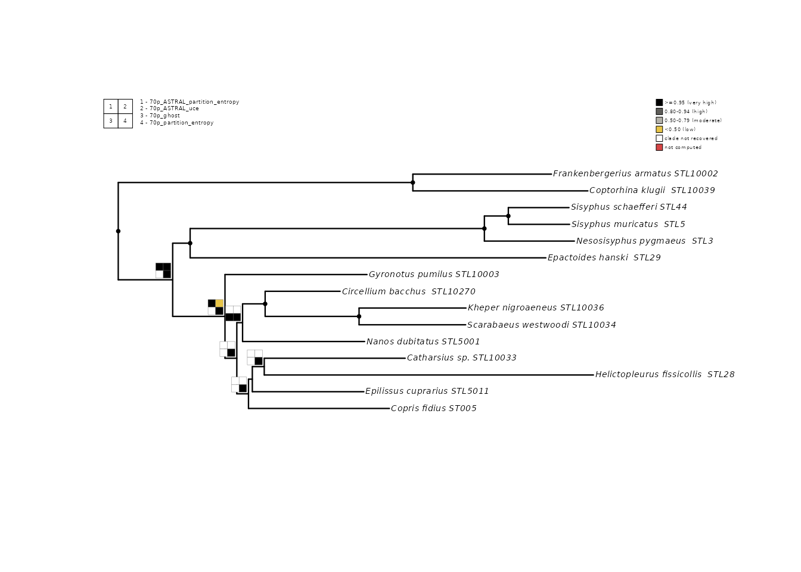

### Grid dimensions

By default, phylorug chooses a roughly square grid. Override with
`n_rows` and `n_cols`:

``` r

#rug with flatend grid
plot_phylorug(backbone, npm, n_rows = 1, n_cols = 4)
```

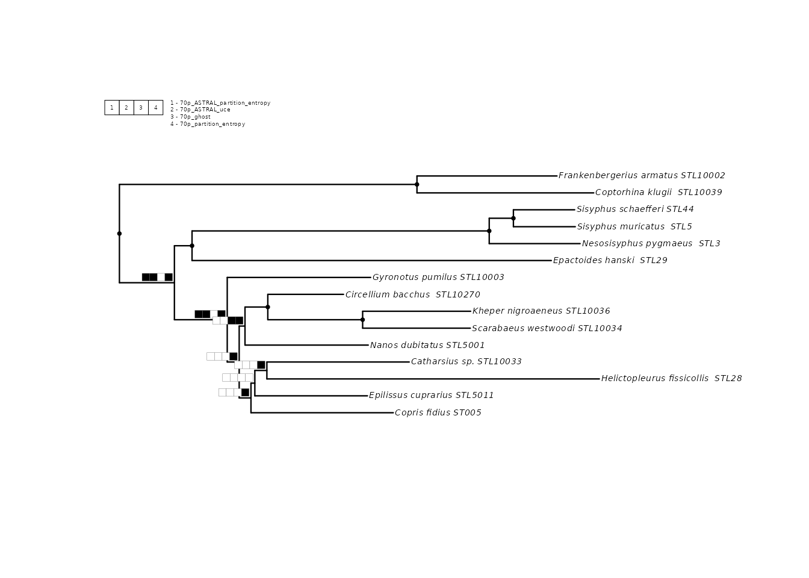

``` r

#rug with squired grid
plot_phylorug(backbone, npm, n_rows = 2, n_cols = 2)
```

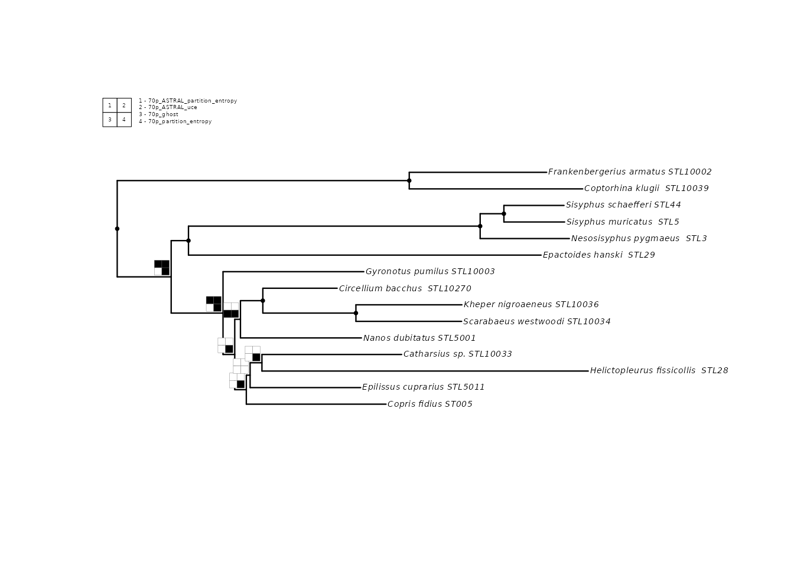

### Tree appearance

[`plot_phylorug()`](https://mdrifathahamed.github.io/phylorug/reference/plot_phylorug.md)
passes additional arguments through `...` to
[`ape::plot.phylo()`](https://rdrr.io/pkg/ape/man/plot.phylo.html).
Common options:

``` r

plot_phylorug(backbone, npm, cex = 0.6, font = 3, edge.width = 1.5)
```

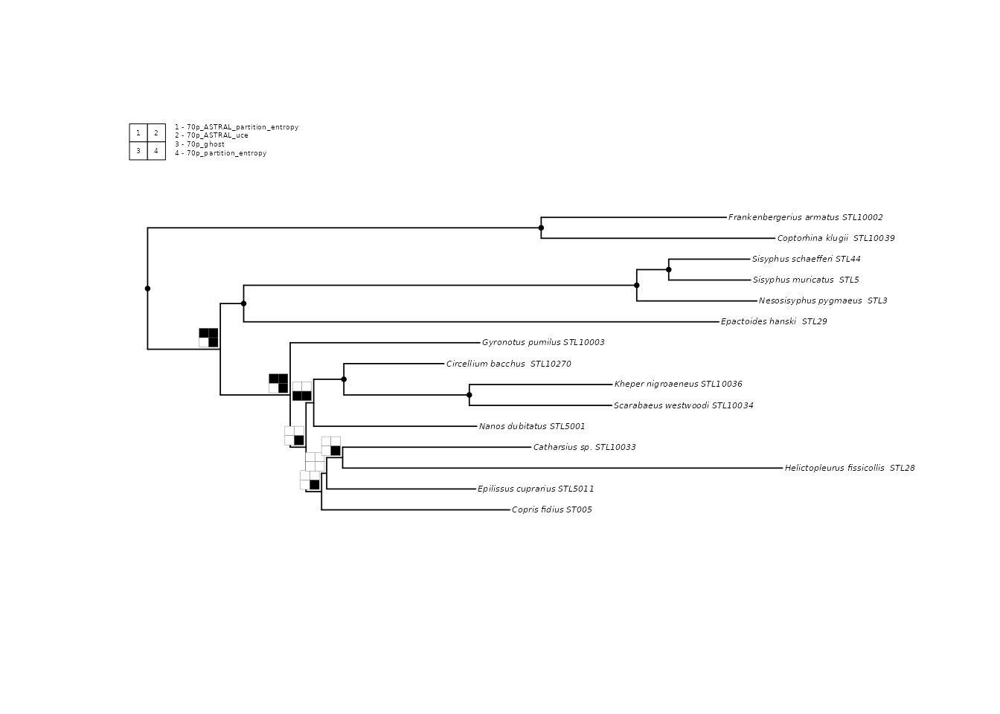

### Including the backbone

By default, the backbone does not occupy a cell in the rug (it trivially
recovers every clade, since it defines the topology). Set
`include_backbone = TRUE` to add it as cell 1:

``` r

plot_phylorug(backbone, npm, include_backbone = TRUE)
```

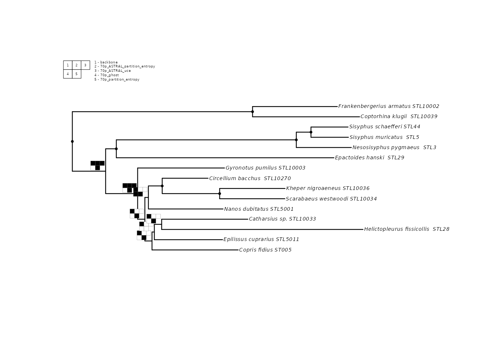

In support mode, pass the backbone’s support metric directly to
`include_backbone` so it gets binned against the correct thresholds:

``` r

plot_phylorug(backbone, npm,
              mode             = "support",
              include_backbone = "ufboot")
```

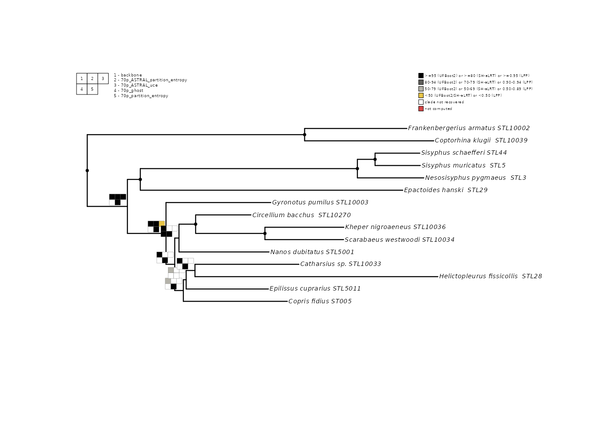

### Custom thresholds

Override the default support bins with your own cutoffs:

``` r

my_thresholds <- list(
  ufboot = c(very_high = 98, high = 90, moderate = 70),
  lpp    = c(very_high = 0.99, high = 0.90, moderate = 0.70)
)

plot_phylorug(
  backbone, npm,
  mode       = "support",
  thresholds = my_thresholds
)
```

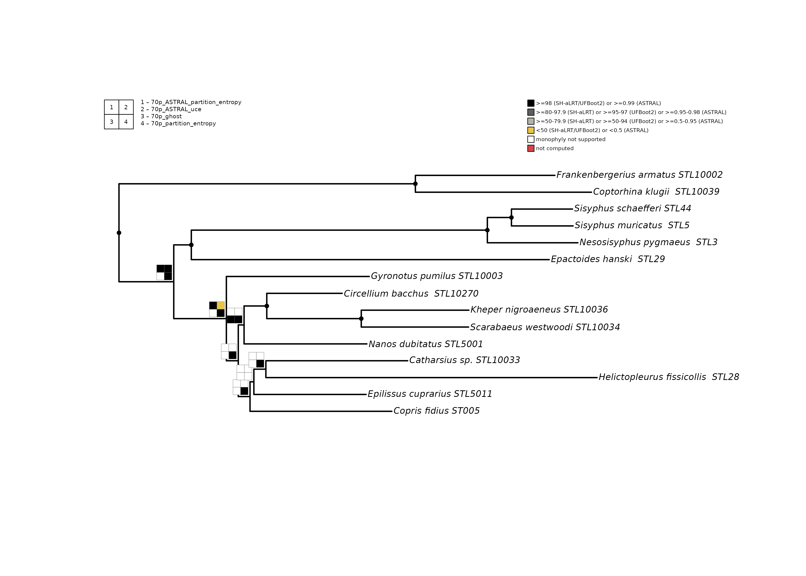

## Tips and best practices

**Root and prune before translating.**
[`translate_tips()`](https://mdrifathahamed.github.io/phylorug/reference/translate_tips.md)
replaces specimen codes with species names. Once translated, you cannot
match outgroup names for rooting. Always: (1) root, (2) drop outgroup,
(3) translate.

**One file = one analysis.**
[`read_trees()`](https://mdrifathahamed.github.io/phylorug/reference/read_trees.md)
treats each file as one analysis. A single-tree file returns a `phylo`;
a file with multiple equally optimal trees (as POY, TNT, or PAUP\* write
them) returns a `multiPhylo` scored as a pool.

**Pool scoring in presence mode.** By default (`pool_threshold = 1.0`),
a clade counts as present only if every tree in the pool recovers it —
equivalent to a strict consensus. Set `pool_threshold = 0.5` for
majority rule, or `pool_threshold = 0` to record the raw proportion
(e.g., 2 out of 3 gives 0.67). A single-tree analysis always records 1
or 0.

**Support mode is not available for pools.** Node labels on tied optima
are not independent support values. Meaningful support (bootstrap,
posterior, SH-aLRT) comes only from explicit resampling or model-based
procedures. To visualize support for a parsimony analysis, compute it
externally (e.g., map bootstrap replicates onto the strict consensus,
per Simmons and Freudenstein 2011), save the summarized tree, and pass
that single file to phylorug. Passing raw tied optima into support mode
would display arbitrary node labels as though they were support values,
producing an artifactual rug.

**Wrap bare `multiPhylo` in a list.** If you construct comparison trees
manually, each element of the list passed to
[`node_presence_matrix()`](https://mdrifathahamed.github.io/phylorug/reference/node_presence_matrix.md)
must be a single `phylo` or a `multiPhylo` (a pool from one search). A
bare `multiPhylo` at the top level is interpreted as one analysis with
multiple tied-optimal trees, not as separate analyses.

**Use
[`prune_to_shared()`](https://mdrifathahamed.github.io/phylorug/reference/prune_to_shared.md)
when taxa differ.** If a comparison tree is missing some backbone taxa,
[`node_presence_matrix()`](https://mdrifathahamed.github.io/phylorug/reference/node_presence_matrix.md)
will refuse to proceed (a clade containing a missing taxon cannot be
evaluated). Run
[`check_taxa()`](https://mdrifathahamed.github.io/phylorug/reference/check_taxa.md)
first to see the discrepancies, then
[`prune_to_shared()`](https://mdrifathahamed.github.io/phylorug/reference/prune_to_shared.md)
to reduce all trees to their common taxa.

## References

- Fu, Y. et al. (2025). Phylogenomic insights into the higher level
  relationships within Culicomorpha (Diptera). *Insect Systematics and
  Diversity*, 9(6), ixaf056.
- Giribet, G. (2003). Stability in phylogenetic formulations and its
  relationship to nodal support. *Systematic Biology*, 52(4), 554–564.
- Lopes, F. et al. (2024). From museum drawer to tree: Historical DNA
  phylogenomics clarifies the systematics of rare dung beetles
  (Coleoptera: Scarabaeinae) from museum collections. *PLOS ONE*,
  19(12), e0309596.
- Montanaro, G., Lopes, F., Gunter, N.L., Scholtz, C., Davis, A.L.,
  Losacco, F., Rossini, M., Gillett, C.P.D.T., Saxton, N.A., Stone,
  R.L., Daniel, G.M., and Tarasov, S. (2026). Phylogenomics resolves a
  200-year-old puzzle: a revised tribal classification of Afro-Eurasian
  dung beetles (Coleoptera: Scarabaeinae). *bioRxiv*.
  <https://doi.org/10.64898/2026.07.22.740134>
- Machado, D. J. (2015). YBYRÁ fossile: a command line system for total
  evidence dating and sensitivity analysis. *BMC Bioinformatics*, 16,
  40. 
- Sanders, K. L. (2010). Cladescan: exhaustive phylogenetic searches of
  consensus support in large data sets. *Cladistics*, 26(6), 598–613.
- Steenwyk, J. L., Li, Y., Zhou, X., Shen, X. X. & Rokas, A. (2023).
  Incongruence in the phylogenomics era. *Nature Reviews Genetics*,
  24(12), 834–850.
- Wheeler, W. C. (1995). Sequence alignment, parameter sensitivity, and
  the phylogenetic analysis of molecular data. *Systematic Biology*,
  44(3), 321–331.
