# Introduction to phylorug

## What problem does phylorug solve?

Phylogenomic studies routinely apply multiple analytical approaches to
infer relationships within a focal group of organisms. Different
inference methods (IQ-TREE, ASTRAL, MrBayes), different data types
(UCEs, transcriptomes, whole genomes), and different models
(site-homogeneous, site-heterogeneous, coalescent) each yield a tree
that may differ in topology and report clade support using different
metrics and formats (Steenwyk et al., 2023).

The question this creates at every node is simple: Does this clade
appear in all analyses, and how strongly does each one support it?

Answering that by opening tree files side by side is tedious and
error-prone, especially as taxon counts and the number of analyses grow.
Additionally, existing tools only measure overall topological distance
between two trees, or quantify gene-tree conflict within a single
pipeline, but neither shows you which clades hold up across analytical
choices and which do not.

*phylorug* fills this gap. It draws a compact coloured grid, a **rug
plot** at every internal node of a reference tree. Each cell represents
one analysis, its colour shows whether that analysis recovered the clade
and, in support mode, how strongly it supported it.

### Brief history

Wheeler (1995) introduced a matrix plot to show how clade recovery
varied across analytical parameters. Each cell represented a combination
of gap cost and transversion-transition ratio, and was marked according
to whether the clade was recovered as monophyletic, left unresolved, or
resolved as nonmonophyletic under that parameter set. By plotting these
matrices for individual clades across the full parameter space, Wheeler
showed which groups were robust to analytical choices and which were
sensitive to them. Giribet (2003) named these plots “Navajo rugs” and
drew a distinction between nodal support and nodal stability. Sanders
(2010) automated the approach with Cladescan (Perl), and Machado (2015)
extended it with YBYRÁ (Python). Both produce standalone SVG files per
node that have to be placed onto the tree by hand in a vector editor,
and neither is maintained today. Both were also built for sensitivity
analysis within a single analytical framework, varying parameters and
cost schemes, rather than comparing trees from different inference
pipelines that report support in incompatible formats (UFBoot2, SH-aLRT,
posterior probability, ASTRAL LPP). phylorug moves this idea into R: it
reads trees from any pipeline, bins support values against thresholds
set for their own metric rather than forcing everything onto one scale,
and draws the rug plot on the reference tree directly, with no manual
placement and no outside software.

#### Nodal support versus nodal stability

Giribet (2003) drew a distinction worth keeping in mind when using
phylorug. **Nodal support** is how confident a single analysis is in a
clade: bootstrap values, posterior probabilities, local posterior
probabilities. **Nodal stability** is whether that clade turns up across
different analytical strategies, data types, and inference methods. The
two can be decoupled: a clade may get 100% bootstrap under one model and
collapse under all others, or carry only moderate support everywhere yet
appear in every tree. Reporting both says more about a clade’s
robustness than either one alone.

phylorug captures this directly. In `presence` mode, a node gets a black
dot if every analysis recovers the clade, or a rug plot showing which
analyses recover it and which do not. That is nodal stability. In
`support` mode, the same rug plot shades each cell by how strongly that
analysis supports the clade, which is nodal support layered on top of
stability. A dot in `support` mode is stricter: it marks a clade that
every analysis recovers and rates as very-high support. A clade
recovered everywhere but not uniformly very-high is drawn as a full rug
plot instead, so support and stability stay visible as separate facts.

## Quick start

The fastest way to see phylorug in action is with the built-in
`sample_trees` dataset, a 15-taxon subset of the beetle data (Montanaro,
Lopes et al., 2026), already rooted, pruned, and with tip labels
translated to scientific names. Let’s start with attaching the package :

``` r

library(phylorug)
```

### Load the data

`sample_trees` is a named list of five `phylo` objects, all sharing the
same 15 taxa. Pick one as the backbone and use the rest as comparisons.
In the original study `70p_uce` is used as a backbone tree.

``` r

names(sample_trees)
#> [1] "70p_ASTRAL_partition_entropy" "70p_ASTRAL_uce"              
#> [3] "70p_ghost"                    "70p_partition_entropy"       
#> [5] "70p_uce"

backbone <- sample_trees[["70p_uce"]]
others   <- sample_trees[names(sample_trees) != "70p_uce"]
```

### Check taxon consistency

[`check_taxa()`](https://mdrifathahamed.github.io/phylorug/reference/check_taxa.md)
compares the tip labels of the backbone against every comparison tree
and reports any mismatches, missing taxa, extra taxa, or spelling
differences. Running it before
[`node_presence_matrix()`](https://mdrifathahamed.github.io/phylorug/reference/node_presence_matrix.md)
is good practice, especially the first time you work with a new dataset.
That said,
[`node_presence_matrix()`](https://mdrifathahamed.github.io/phylorug/reference/node_presence_matrix.md)
will stop with a clear error if a comparison tree is missing a backbone
taxon, so if you already know your trees share the same taxa you can
skip straight to building the matrix :

``` r

check_taxa(backbone, others)
#> All 4 comparison trees share the same 15 taxa as the backbone.
#> [1] TRUE
#> attr(,"diagnostics")
#>                     comparison    status n_taxa missing extra
#> 1 70p_ASTRAL_partition_entropy identical     15              
#> 2               70p_ASTRAL_uce identical     15              
#> 3                    70p_ghost identical     15              
#> 4        70p_partition_entropy identical     15
```

All trees share the same 15 taxa, so we can proceed. If a mismatch is
reported the helper function
[`prune_to_shared()`](https://mdrifathahamed.github.io/phylorug/reference/prune_to_shared.md)
can be used to get identical taxa set.

### Build the node presence matrix

[`node_presence_matrix()`](https://mdrifathahamed.github.io/phylorug/reference/node_presence_matrix.md)
is the core function of the pipeline. It walks every internal node of
the backbone, checks whether each comparison tree recovered that clade,
and records its support value.

It returns a named list: a **presence matrix** (1 = clade recovered, 0 =
absent), plus one or more **support matrices** holding the support
values pulled from each tree’s node labels. By default it reads the
first value in each label. If your trees carry compound labels like
`100/98` (SH-aLRT/UFBoot2 from IQ-TREE, for example), `support_col`
picks which one to use: `support_col = 1` for the first,
`support_col = 2` for the second, or `support_col = c(1, 2)` to pull
both at once and makes two **support matrices**.

Two more arguments belong here. `support_type` is a named character
vector telling
[`node_presence_matrix()`](https://mdrifathahamed.github.io/phylorug/reference/node_presence_matrix.md)
which support metric each comparison tree uses (`"ufboot"`, `"lpp"`,
`"sh_alrt"`, `"posterior"`). It gets stored with the result and
[`plot_phylorug()`](https://mdrifathahamed.github.io/phylorug/reference/plot_phylorug.md)
reads it automatically in support mode, so you only declare it once,
here.

`pool_threshold` matters when a comparison tree file holds several
equally optimal trees (a pool) instead of one. It sets how many of them
need to recover a clade before it counts as present: `1.0` (the default)
a strict consensus; `0.5` needs just a majority; `0` skips the cutoff
entirely and records the raw fraction that recovered it. `sample_trees`
is all single `phylo` objects, no pools, so `pool_threshold` doesn’t
come into play here.

We declare `support_type` now so
[`plot_phylorug()`](https://mdrifathahamed.github.io/phylorug/reference/plot_phylorug.md)
can bin each tree’s support values against the right thresholds for its
own metric:

``` r

support_type <- c(
  "70p_ASTRAL_partition_entropy" = "lpp",
  "70p_ASTRAL_uce"               = "lpp",
  "70p_ghost"                    = "ufboot",
  "70p_partition_entropy"        = "ufboot"
)
```

``` r

npm <- node_presence_matrix(backbone, others, support_col = c(1, 2), support_type = support_type)
```

The result is a named list. `npm$presence` is a matrix of 1s and 0s.
`npm$support_1` and `npm$support_2` hold the raw support values. The
list also carries `support_type` as an attribute, and all of these are
what
[`plot_phylorug()`](https://mdrifathahamed.github.io/phylorug/reference/plot_phylorug.md)
uses to draw the rug: presence determines whether a cell is filled or
empty; support determines its shade.

### Plot the rug

With the node presence matrix ready,
[`plot_phylorug()`](https://mdrifathahamed.github.io/phylorug/reference/plot_phylorug.md)
draws the rug on the backbone. In its simplest form, all arguments are
defaults: `mode = "presence"`, `dot_identical = TRUE` (unanimous nodes
get a black dot), `legend = TRUE`, `show_support = TRUE` (the backbone’s
own support values are shown alongside the rug), and
`rug_position = "inside"`. The internal scaling engine sizes the canvas,
fonts, and cell dimensions automatically based on tree size. Here
`show_support = FALSE` keeps this first figure to presence and absence
only.

``` r

plot_phylorug(backbone, npm, show_support = FALSE)
```

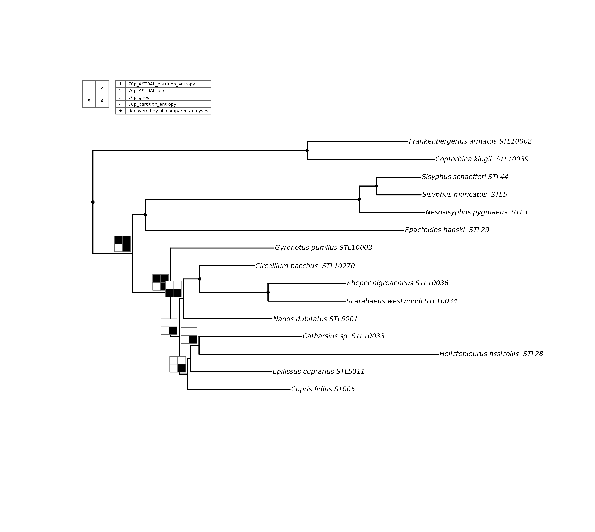

For publication-quality output, setting `file`, `width`, and `height` is
strongly recommended. All other arguments are worth exploring to
fine-tune your figure, but these three matter most.

``` r

plot_phylorug(backbone, npm, file = "presence.pdf", width = 12, height = 8)
```

### Support mode

Now switch to support mode to see how strongly each tree supports each
clade. Cells are shaded by binned support strength, darker means
stronger. Support values are binned against thresholds specific to their
own metric: a tree with LPP 0.95 and a tree with LPP 0.65 are compared
to LPP thresholds, while a tree carrying UFBoot2 values is binned
against UFBoot2 thresholds independently. *phylorug* never
cross-compares values from different support metrics, because LPP 0.95
and UFBoot2 95 do not measure the same thing despite looking numerically
similar.

Since we already declared `support_type` when building the node presence
matrix,
[`plot_phylorug()`](https://mdrifathahamed.github.io/phylorug/reference/plot_phylorug.md)
reads it automatically from the stored attribute and applies the correct
metric-specific thresholds.

If `support_type` is not declared,
[`plot_phylorug()`](https://mdrifathahamed.github.io/phylorug/reference/plot_phylorug.md)
falls back to a universal threshold scale: values greater than 1 are
divided by 100 to bring them onto a 0–1 scale, and all trees are binned
against the same set of thresholds regardless of metric. This is a
reasonable starting point for quick exploration, but declaring
`support_type` is always preferred because it ensures each value is
evaluated against the thresholds published for its own method.

``` r

plot_phylorug(
  backbone, npm,
  mode         = "support")
```

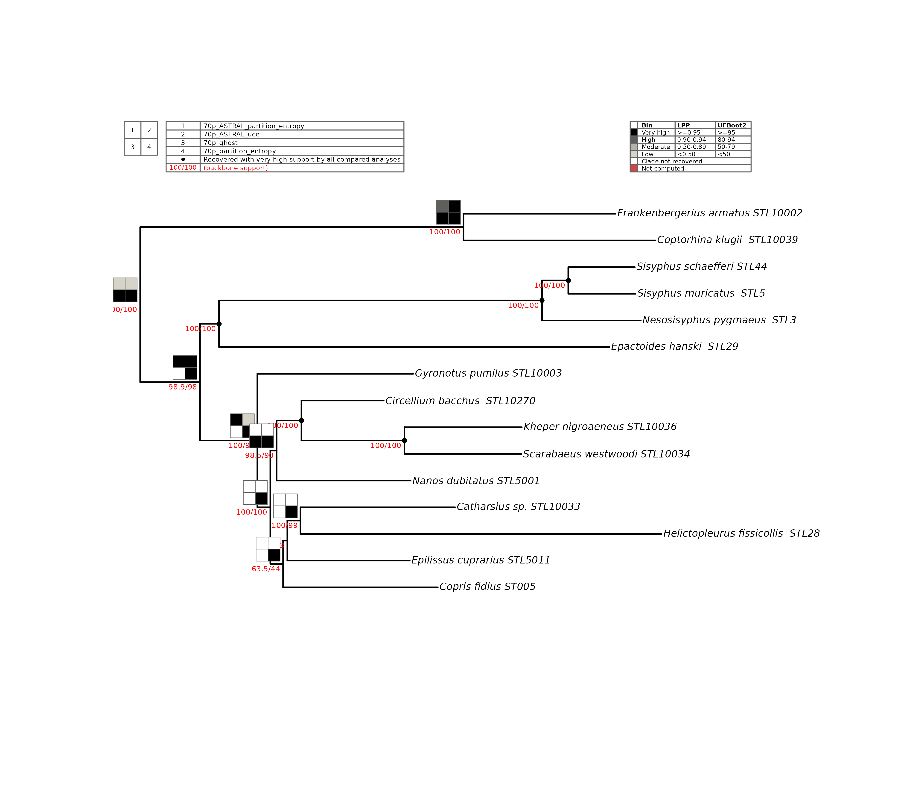

In support mode a dot carries more information than in presence mode. It
marks a clade that every comparison analysis recovers *and* rates
very-high support against its own metric’s thresholds. A clade recovered
by every analysis but weaker in even one, or with no usable support
value, is drawn as a rug plot instead, so a dot never hides uneven
support. Because the rule uses the same thresholds that shade the cells,
changing `thresholds` also changes which nodes earn a dot (see
Customisation).

## Reading the rug plot

The rug plot carries two legends. The **position legend** (top-left)
maps each numbered cell to a tree. For example, cell 1 is the first
tree, cell 2 the second, and so on. The **threshold legend** (top-right,
support mode only) shows what each shade means.

At each node you will see one of these patterns:

- **Black dot**: in presence mode, all analyses recover this clade
  unanimously (`dot_identical = TRUE`, the default). In support mode a
  dot is stricter: all analyses recover the clade and every one rates it
  *very-high* support (`dot_on_very_high = TRUE`, the default). No rug
  is drawn at a dot, to reduce clutter.
- **Rug plot with no white cells** (support mode only): every analysis
  recovers the clade, but at least one does not rate it very-high, or
  reports no usable support value.
- **Mixed grid**: some cells filled with solid black, some white. These
  are the interesting nodes, the position legend tells you which
  analysis agrees and which disagrees.
- **Bare node** (no dot, no rug): no comparison tree recovers this
  backbone clade, it exists only in the backbone topology. This is the
  default behaviour (`hide_unsupported = TRUE`). Set
  `hide_unsupported = FALSE` to draw all-white rug plots at these nodes
  instead.

In support mode, filled cells are shaded by how strongly each analysis
supports the clade. The colour scheme is a four-step greyscale from
black (very high) through dark grey (high) and light grey (moderate) to
pale grey (low), so a lighter cell always means weaker support. White
means the clade was not recovered, and red means it was recovered but no
support value could be parsed. The thresholds shown below are the
package defaults. Different fields and journals apply different cutoffs,
so we recommend defining your own via the `thresholds` argument (see the
Customisation section below):

- **Black**: very high support (UFBoot2 \>= 95, SH-aLRT \>= 80, LPP
  \>=0.95).
- **Dark grey**: high support (UFBoot2 80-94, SH-aLRT 70-79, LPP
  0.90-0.94).
- **Light grey**: moderate support (UFBoot2 50-79, SH-aLRT 50-69, LPP
  0.50-0.89).
- **Pale grey**: low support (below 50 for UFBoot2/SH-aLRT, below 0.50
  for LPP). Present but weakly endorsed. It is lighter than the light
  grey of the moderate bin but still visibly darker than white.
- **White**: clade not recovered by that analysis.
- **Red**: clade recovered but no support value could be parsed from the
  node label. This can happen when the tree file carries no node labels,
  the label is not numeric, or the original analysis did not report
  support at that node.

## Fine-tuning the figure

Dots in support mode follow the very-high rule described above
(`dot_on_very_high`; see Customisation to turn them off).
`hide_unsupported = FALSE` would draw all-white rugs at nodes unique to
the backbone; the default (`TRUE`) leaves them bare. `cell_scale`
adjusts the size of each rug cell, `rug_position` controls whether rugs
sit toward the root (`"inside"`) or toward the tips (`"outside"`).
`dot_cex` scales the dot, and `show_support = TRUE` with
`support_label_cex` and `support_label_col` overlays the backbone’s own
support labels on the tree. `cex` and `font` are passed directly to the
tree plotter. For publication output, add `file = "output.pdf"` along
with `width` and `height` to produce a properly scaled figure.

``` r

# For publication output, add:
# file = "my_support_plot.pdf"
plot_phylorug(
  backbone, npm,
  width             = 6.5,
  height            = 5.8,
  mode              = "support",
  rug_position      = "inside",
  cell_scale        = 0.38,
  cex               = 0.90,
  font              = 3,
  dot_cex           = 1.3,
  show_support      = TRUE,
  support_label_col = "red",
  support_label_cex = 0.4
)
```

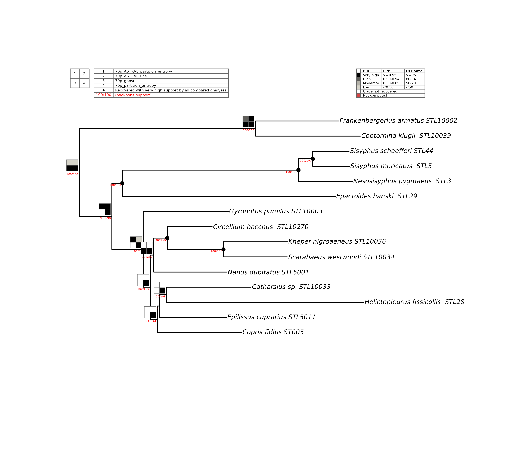

## Working with real data: Culicomorpha

The built-in Culicomorpha dataset contains 10 phylogenomic analyses of
46 taxa from eight Diptera families (Fu et al., 2025), covering IQ-TREE
partitioned, PMSF, LG+C20+F+R, and ASTRAL strategies.

### Read the trees

[`read_trees()`](https://mdrifathahamed.github.io/phylorug/reference/read_trees.md)
scans a directory for tree files and returns a named list:

``` r

tree_dir <- system.file("extdata", "culicomorpha", package = "phylorug")
trees    <- read_trees(tree_dir)
#> Read 10 analyses (10 trees) from: /home/runner/work/_temp/Library/phylorug/extdata/culicomorpha
names(trees)
#>  [1] "Matrix1_LG_C20_F_R"           "Matrix1-kpi_ASTRAL"          
#>  [3] "Matrix1-kpi_partitioning"     "Matrix1-kpi_PMSF(H1.guide)"  
#>  [5] "Matrix1-kpi_PMSF(H2.guide)"   "Matrix1-smart_ASTRAL"        
#>  [7] "Matrix1-smart_partitioning"   "Matrix1-smart_PMSF(H1.guide)"
#>  [9] "Matrix1-smart_PMSF(H2.guide)" "Matrix2_partitioning"
```

### Root and remove the outgroups

The *Culicomorpha* trees include three outgroup taxa from outside the
infraorder: *Phlebotomus chinensis* and *Clogmia albipunctata
(Psychodidae)* and *Coboldia fuscipes (Scatopsidae)*. Root on all three,
then drop them. The order matters, you must root while the outgroup tips
are still present, because
[`ape::root()`](https://rdrr.io/pkg/ape/man/root.html) needs to find
them in the tree:

``` r

trees <- lapply(trees, function(tr) {
  tr <- ape::root(tr, outgroup = c("Coboldia_fuscipes",
                                   "Phlebotomus_chinensis",
                                   "Clogmia_albipunctata"),
                  resolve.root = TRUE)
  ape::drop.tip(tr, c("Coboldia_fuscipes",
                      "Phlebotomus_chinensis",
                      "Clogmia_albipunctata"))
})
```

The Culicomorpha trees already carry species names as tip labels, so no
translation is needed here. For trees with specimen codes, see
[`translate_tips()`](https://mdrifathahamed.github.io/phylorug/reference/translate_tips.md)
in the beetles example below.

### Choose a backbone

Pick one analysis as the backbone. The remaining trees are comparisons:

``` r

backbone <- trees[["Matrix1-kpi_PMSF(H1.guide)"]]
others   <- trees[names(trees) != "Matrix1-kpi_PMSF(H1.guide)"]
```

### Check taxon consistency

``` r

check_taxa(backbone, others)
#> All 9 comparison trees share the same 43 taxa as the backbone.
#> [1] TRUE
#> attr(,"diagnostics")
#>                     comparison    status n_taxa missing extra
#> 1           Matrix1_LG_C20_F_R identical     43              
#> 2           Matrix1-kpi_ASTRAL identical     43              
#> 3     Matrix1-kpi_partitioning identical     43              
#> 4   Matrix1-kpi_PMSF(H2.guide) identical     43              
#> 5         Matrix1-smart_ASTRAL identical     43              
#> 6   Matrix1-smart_partitioning identical     43              
#> 7 Matrix1-smart_PMSF(H1.guide) identical     43              
#> 8 Matrix1-smart_PMSF(H2.guide) identical     43              
#> 9         Matrix2_partitioning identical     43
```

### Build the matrix and plot

``` r

support_type <- c(
  "Matrix1-kpi_ASTRAL"            = "lpp",
  "Matrix1-smart_ASTRAL"          = "lpp",
  "Matrix1-kpi_partitioning"      = "sh_alrt",
  "Matrix1-kpi_PMSF(H2.guide)"    = "sh_alrt",
  "Matrix1_LG_C20_F_R"            = "sh_alrt",
  "Matrix1-smart_partitioning"    = "sh_alrt",
  "Matrix1-smart_PMSF(H1.guide)"  = "sh_alrt",
  "Matrix1-smart_PMSF(H2.guide)"  = "sh_alrt",
  "Matrix2_partitioning"          = "sh_alrt"
)
```

``` r

npm <- node_presence_matrix(backbone, others, support_type = support_type)
```

### Presence mode

``` r

plot_phylorug(backbone, npm, show_support = FALSE)
```

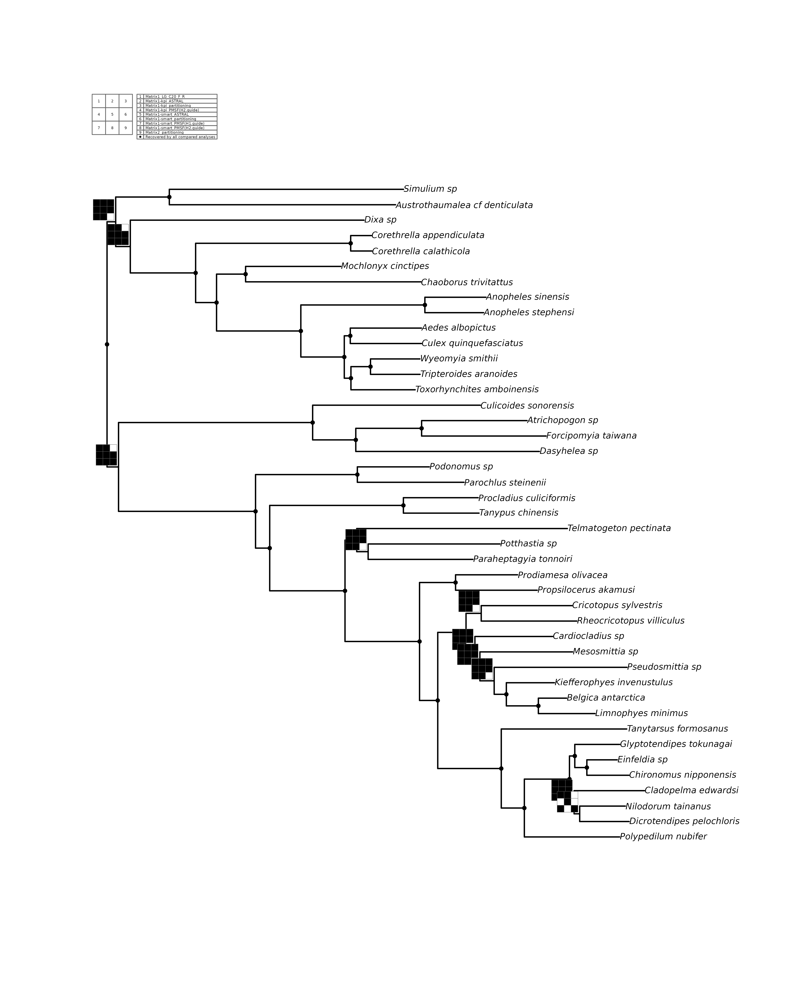

With 9 comparison trees, phylorug automatically arranges the rug grid (3
columns by 3 rows in this case). The position legend maps each cell
position to an analysis name.

### Support mode

Here we use `show_support = TRUE` to overlay the backbone’s own node
labels in red for cross-referencing, with `show_support_idx = 1` to
display only the first support metric instead of the full compound label
(e.g. showing `100` rather than `100/100`). `cell_scale = 0.3` shrinks
the rug cells slightly for a denser tree. All-white rugs are hidden by
default, so only contested and stable nodes remain visible.

``` r

plot_phylorug(backbone, npm,
              mode               = "support",
              show_support       = TRUE,
              show_support_idx   = 1,
              support_label_cex  = 0.35,
              support_label_col  = "red",
              cell_scale         = 0.3,
              rug_position       = "outside")
```

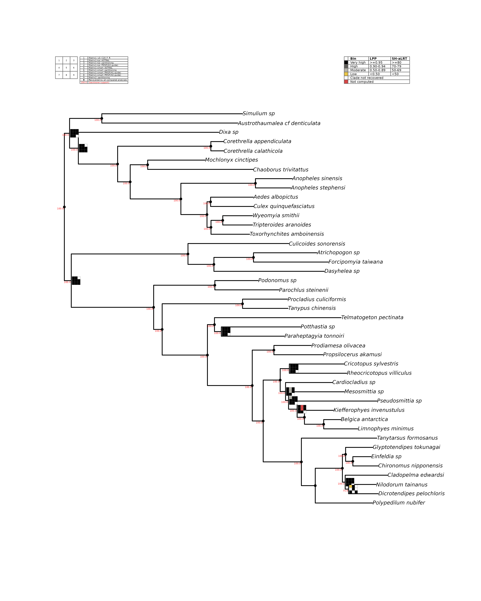

### What the rug reveals

The rug immediately separates stable from contested regions of the
*Culicomorpha* tree. Most nodes carry black dots, meaning every
comparison analysis recovered the clade and rated it very-high support.
All family-level groupings such as *Culicidae*, *Chironomidae*,
*Ceratopogonidae*, and the *Simuliidae* + *Thaumaleidae* clade, show
complete agreement across every inference method and dataset.

The main exception is the node uniting *Chironomidae* and
*Ceratopogonidae* as sister groups, the most contentious relationship in
culicomorph systematics. Eight of nine comparison analyses recover this
clade with strong support, but the site-homogeneous partitioned analysis
of the kpi-trimmed matrix (Matrix1-kpi_partitioning) fails to recover it
entirely. This is consistent with the finding of Fu et al. (2025) that
site-homogeneous models are more prone to missing this relationship, and
the pattern is immediately visible in the rug without consulting
multiple tree files.

Two additional areas show disagreement. Near the base of *Chironomidae*,
the rug plots at the node uniting *Podonomus* and *Parochlus steinenii*
show mixed shading, indicating that the internal arrangement of basal
chironomid lineages varies across methods. Near the tips, the node at
*Nilodorum* + *Dicrotendipes* (backbone support 75.0) shows grey
shading, moderate support in the backbone that is not unanimously
endorsed by all comparison analyses.

A few cells appear red at nodes within *Chironomidae*. Red means the
analysis recovered the clade but no support value could be parsed from
the node label. In this dataset, the original tree files do not carry
support values at those nodes, so phylorug correctly marks them as not
computed.

In contrast, the placement of *Dixidae* relative to the core
*Culicoidea* clade is stable across all methods, a finding that would
require checking each tree individually without phylorug.

This is the core value of `phylorug`: patterns that required opening 10
separate tree files side by side in the original study are condensed
onto a single figure. A reader can immediately see which nodes are
robust to analytical choice and which deserve further investigation.

## Full pipeline: beetles with tip translation

The beetle dataset ships with `phylorug` in `inst/extdata/`. It contains
two sets of trees, a 43-taxon subset of Montanaro, Lopes et al. (2026)
representing the subtribe Onthophagina *sensu lato*: beetles_50p/ and
beetles_70p/, each with 5 independent analyses (45 tips including 2
outgroups) built from UCE loci retained at different completeness
thresholds (50% and 70%). The two datasets produce slightly different
topologies, making them a good test case for exploring how data
filtering affects clade recovery. For this vignette we use the 70p set,
but users are encouraged to try both. Unlike the *Culicomorpha* trees,
these trees store specimen codes as tip labels (e.g., `"OntauST002"`
rather than a species name), so this example adds one extra step:
translating tip labels using a lookup table before building the rug
plots.

### Read the trees

``` r

tree_dir <- system.file("extdata", "beetles_70p", package = "phylorug")
trees    <- read_trees(tree_dir)
#> Read 5 analyses (5 trees) from: /home/runner/work/_temp/Library/phylorug/extdata/beetles_70p
names(trees)
#> [1] "70p_ASTRAL_partition_entropy" "70p_ASTRAL_uce"              
#> [3] "70p_ghost"                    "70p_partition_entropy"       
#> [5] "70p_uce"
```

### Root and drop outgroups

The beetle trees include two outgroup taxa, *NicorbUCE* and *NicvesUCE*.
We will root on them first, then drop them. As before, rooting must
happen while the outgroup tips are still in the tree.

``` r

trees <- lapply(trees, function(tr) {
  tr <- ape::root(tr, outgroup = c("NicorbUCE", "NicvesUCE"),
                  resolve.root = TRUE)
  ape::drop.tip(tr, c("NicorbUCE", "NicvesUCE"))
})
```

### Translate tip labels

The trees still carry specimen codes at this point. A CSV file
`biogeo.csv` included with the package maps each code to its species
name. Let’s load it and check the first few rows:

``` r

biogeo_path <- system.file("extdata", "beetles_70p", "biogeo.csv",
                           package = "phylorug")
biogeo <- read.csv(biogeo_path)
head(biogeo)
#>   specimen_code                                    species_name
#> 1   STL10208208                    Amietina_larrochei__STL10208
#> 2     AmppriUCE              Amphistomus_primonactus_Amppri_UCE
#> 3    STL1009595                   Anonychonitis_freyi__STL10095
#> 4   Anop1COL892                         Anoplostethus_sp_COL892
#> 5    ApimmST003                         Aphodius_immundus_ST003
#> 6   STL10140140 Apotolamprus_aff_ambohitsitondronensi__STL10140
```

Now let’s translate. The ordering rule from earlier applies here. First
root and drop outgroups before translating, because
[`translate_tips()`](https://mdrifathahamed.github.io/phylorug/reference/translate_tips.md)
replaces the original codes and
[`ape::root()`](https://rdrr.io/pkg/ape/man/root.html) would no longer
find ” *NicorbUCE* ” after translation.

``` r

trees <- translate_tips(trees, biogeo,
                        from_col = "specimen_code",
                        to_col   = "species_name")
#> 70p_ASTRAL_partition_entropy: 43 tips translated, 0 unchanged
#> 70p_ASTRAL_uce: 43 tips translated, 0 unchanged
#> 70p_ghost: 43 tips translated, 0 unchanged
#> 70p_partition_entropy: 43 tips translated, 0 unchanged
#> 70p_uce: 43 tips translated, 0 unchanged
```

### Choose a backbone and check taxa

``` r

backbone <- trees[["70p_uce"]]
others   <- trees[names(trees) != "70p_uce"]
check_taxa(backbone, others)
#> All 4 comparison trees share the same 43 taxa as the backbone.
#> [1] TRUE
#> attr(,"diagnostics")
#>                     comparison    status n_taxa missing extra
#> 1 70p_ASTRAL_partition_entropy identical     43              
#> 2               70p_ASTRAL_uce identical     43              
#> 3                    70p_ghost identical     43              
#> 4        70p_partition_entropy identical     43
```

### Build the node presence matrix

The beetle trees carry compound node labels (`SH-aLRT/UFBoot2` for
`IQ-TREE trees`). Extract both support values with
`support_col = c(1, 2)`:

``` r

support_type <- c(
  "70p_partition_entropy"        = "ufboot",
  "70p_ghost"                    = "ufboot",
  "70p_ASTRAL_uce"               = "lpp",
  "70p_ASTRAL_partition_entropy" = "lpp"
)
```

``` r

npm <- node_presence_matrix(backbone, others, support_col = c(1, 2),
                            support_type = support_type)
```

### Presence mode

At 43 taxa the tree is comfortably readable. All-white rugs are hidden
by default, and writing to a file with explicit width and height is
strongly recommended to avoid the distortion that GUI windows introduce.

``` r

plot_phylorug(backbone, npm)
```


### Support mode

With 43 taxa, the canvas still fits a single page. The backbone tree
carries compound IQ-TREE labels in the format SH-aLRT/UFBoot2 (e.g.,
`99.9/97`). The `show_support_idx` argument controls which part of that
label appears on the tree: `show_support_idx = 1` shows only SH-aLRT,
`show_support_idx = 2` shows only UFBoot2, and a named vector like
`c("1" = "sh_alrt", "2" = "ufboot")` shows both and names them in the
legend. Here we use the named form so the legend identifies each metric:

``` r

# For publication output, add:
# file = "beetles_support.pdf"
# height = 12 
# width = 10
plot_phylorug(
  backbone,
  npm,
  mode               = "support",
  show_support       = TRUE,
  show_support_idx   = c("1" = "sh_alrt", "2" = "ufboot"),
  support_label_col  = "red",
  support_label_cex  = 0.34,
  cell_scale         = 0.35,
  cex                = 0.8
)
```

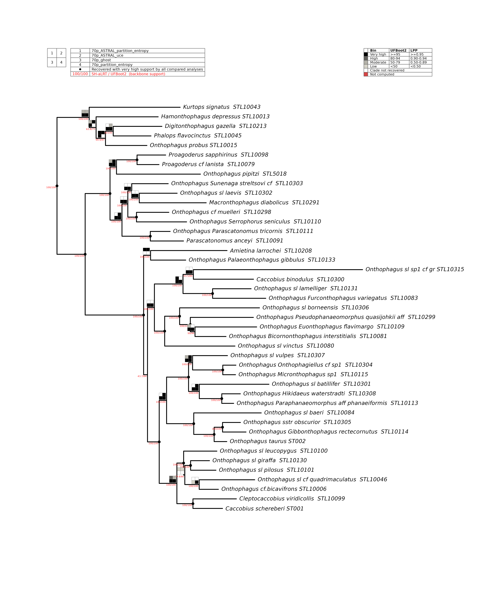

### What the rug reveals

The 43-taxon subset corresponds exactly to the subtribe Onthophagina
*sensu lato* as defined by Montanaro, Lopes et al. (2026, Fig. 2). Above
we applied both presence mode and support mode to the same dataset.
Presence mode shows which analyses recovered each clade; support mode
goes further by showing how strongly each analysis backs each node.

Most nodes within Onthophagina carry black dots: all four comparison
analyses recover the clade and rate it very-high support. The added
value of support mode becomes visible at nodes where not all analyses
recover the clade, or where they recover it with uneven support.

The clade containing species of Caccobius, Cleptocaccobius, and
Onthophagus (backbone support 43.7/64 SH-aLRT/UFBoot2) is the most
weakly supported node in the entire subtribe. No dot or rug appears at
this node, meaning none of the comparison analyses recovered this clade.
This confirms that the placement of *Caccobius* relative to
*Onthophagus* is unresolved across methods.

Weak support and partial recovery are also visible deeper within the
*Onthophagus* radiation. The node uniting *O. giraffa* + *O. pilosus*
with *O. bicavifrons* + *O. quadrimaculatus* (backbone support 59.8/66)
shows moderate-to-low support shading in the analyses that recover the
clade, while others fail to recover it entirely. Within this group the
sister pair *O. quadrimaculatus* + *O. bicavifrons* is recovered with
strong support only by the backbone and the partitioned IQ-TREE
analysis; the GHOST analysis supports it weakly, while both ASTRAL trees
fail to recover the clade entirely. This is a clear
coalescent-versus-concatenation disagreement that support mode makes
visible. In presence mode alone, this node would look the same as any
other partially recovered clade.

The Phalops group (*Kurtops*, *Hamonthophagus*, *Digitonthophagus*,
*Phalops*, and *O. probus*) at the base of Onthophagina is recovered as
a clade by all five analyses. However, the relationships inside the
group tell a different story. The rug at the node uniting
*Hamonthophagus* with *Digitonthophagus* + *Phalops* + *O. probus*
(backbone support 63.8/73) shows mixed shading, meaning some analyses
support this placement only weakly. One step deeper, the node grouping
*Digitonthophagus*, *Phalops*, and *O. probus* (backbone support
99.9/97) also shows disagreement, high backbone support does not
guarantee agreement across methods. Even the *Digitonthophagus* +
*Phalops* pair (backbone support 100/100) is not recovered by the ASTRAL
partitioned analysis. The Phalops group itself is stable, but the
relationships among its members depend on the method.

These three cases: complete absence, partial weak recovery, and
unanimous recovery with uncertain relationships within the group -
capture different levels of conflict that support mode makes visible.

In support mode a black dot is a complete summary: the clade was
recovered everywhere and every analysis has very-high support values.
Nodes recovered everywhere but support is not uniformly very high are
drawn as rug plots. To draw the grid at every node, including those that
would otherwise get a dot, set `dot_on_very_high = FALSE`.

## Customisation

The remaining examples use the compact `sample_trees` dataset to
demonstrate optional arguments. Reload the backbone and rebuild the node
presence matrix:

``` r

backbone <- sample_trees[["70p_uce"]]
others   <- sample_trees[names(sample_trees) != "70p_uce"]
support_type <- c(
  "70p_ASTRAL_partition_entropy" = "lpp",
  "70p_ASTRAL_uce"               = "lpp",
  "70p_ghost"                    = "ufboot",
  "70p_partition_entropy"        = "ufboot"
)
npm <- node_presence_matrix(backbone, others, support_col = c(1, 2),
                            support_type = support_type)
```

### Dots in support mode

By default a dot marks only the nodes that every analysis recovers and
rates very-high. To draw the full grid at every node instead, set
`dot_on_very_high = FALSE`. This is the most conservative option, since
no dot can stand in for detail. It affects support mode only; in
presence mode, `dot_identical` controls dots.

``` r

plot_phylorug(backbone, npm, mode = "support", dot_on_very_high = FALSE)
```

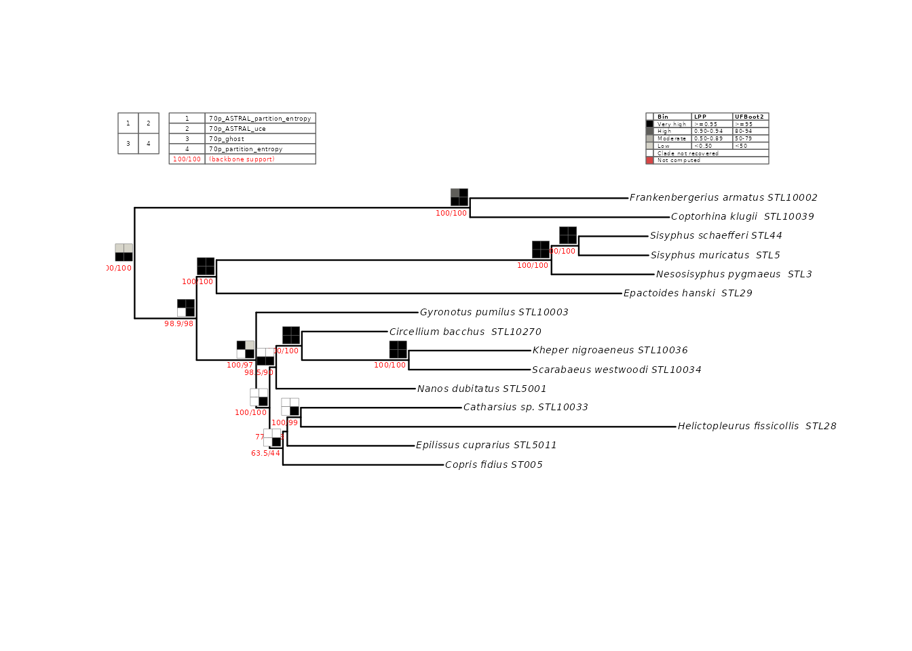

### Universal thresholds (no support_type)

If `support_type` is not declared when building the node presence
matrix,
[`plot_phylorug()`](https://mdrifathahamed.github.io/phylorug/reference/plot_phylorug.md)
falls back to universal thresholds. Values greater than 1 are divided by
100 to bring them onto a 0–1 scale, and all trees are binned against the
same cutoffs regardless of metric. This is useful for quick exploration
but less precise than metric-specific binning:

``` r

npm_universal <- node_presence_matrix(backbone, others, support_col = c(1, 2))

plot_phylorug(
  backbone, npm_universal,
  mode = "support"
)
#> No `support_type` declared: values >1 are divided by 100 and binned against universal thresholds (0.95/0.80/0.50). To use metric-specific thresholds, pass `support_type` to `node_presence_matrix()`. To customise the universal thresholds, use the `thresholds` argument, e.g. `thresholds = list(universal = c(very_high = 0.95, high = 0.80, moderate = 0.50))`.
```

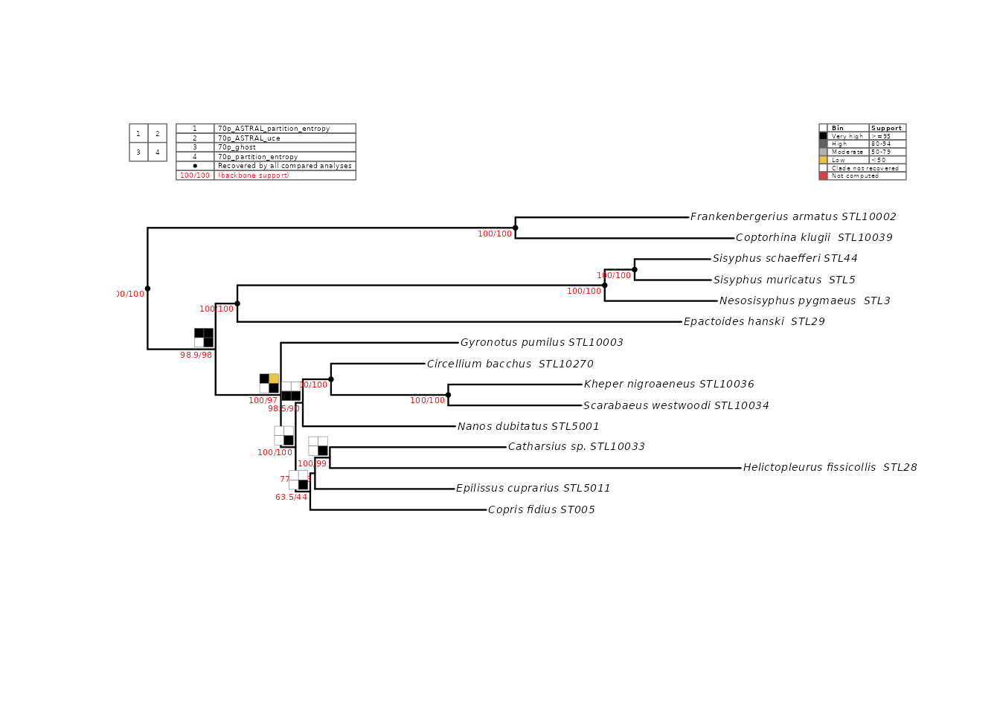

### Grid dimensions

By default, phylorug chooses a roughly square grid. Override with
`n_rows` and `n_cols`:

``` r

# rug with a flattened grid
plot_phylorug(backbone, npm, n_rows = 1, n_cols = 4)
```

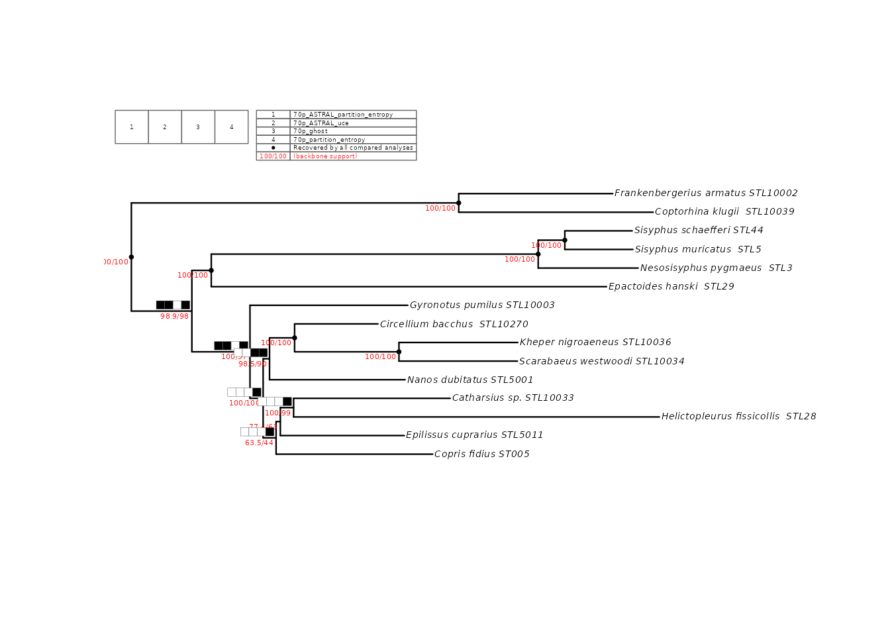

### Tree appearance

[`plot_phylorug()`](https://mdrifathahamed.github.io/phylorug/reference/plot_phylorug.md)
passes additional arguments through `...` to
[`ape::plot.phylo()`](https://rdrr.io/pkg/ape/man/plot.phylo.html).
Common options:

``` r

plot_phylorug(backbone, npm, cex = 0.6, font = 3, edge.width = 1.5)
```

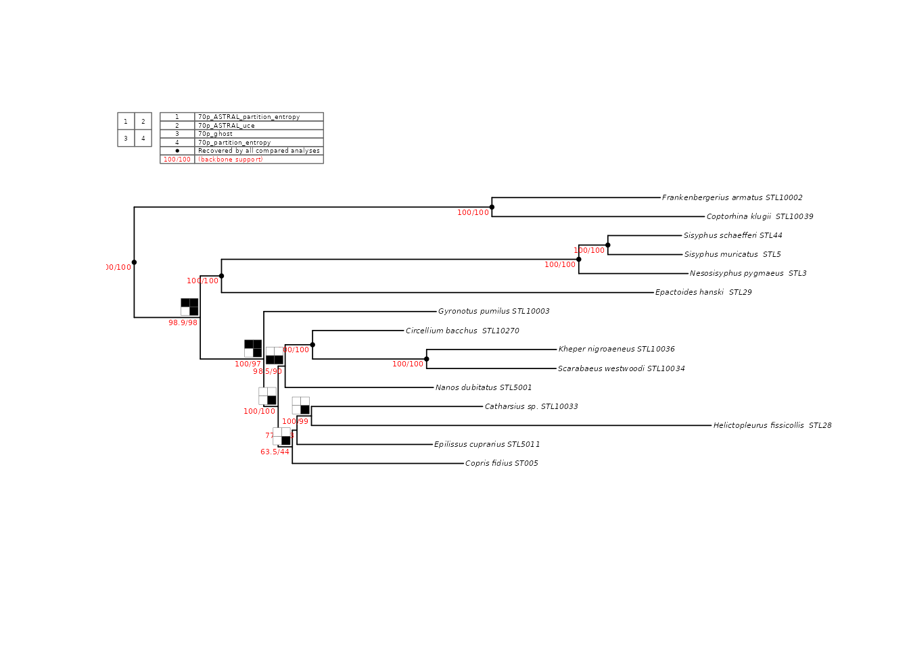

### Including the backbone

By default, the backbone does not occupy a cell in the rug (it trivially
recovers every clade, since it defines the topology). Set
`include_backbone = TRUE` to add it as cell 1:

``` r

plot_phylorug(backbone, npm, include_backbone = TRUE)
```

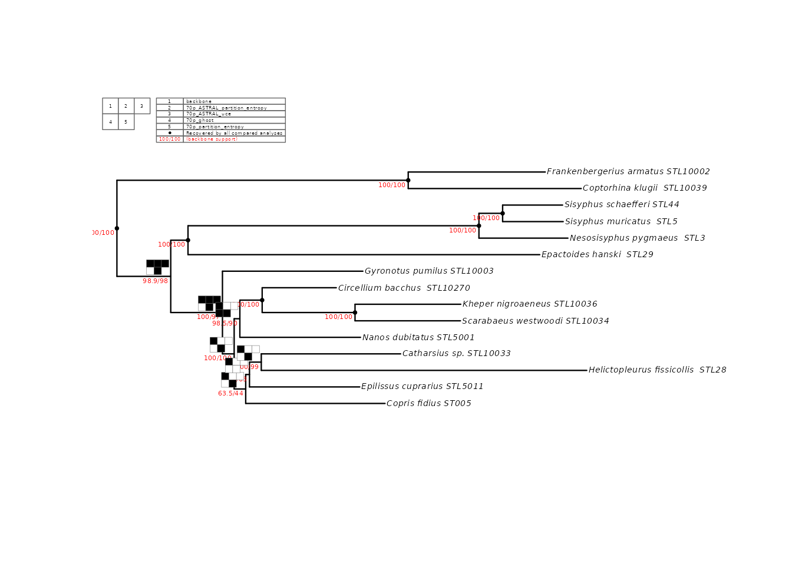

In support mode, pass the backbone’s support metric directly to
`include_backbone` so it gets binned against the correct thresholds:

``` r

plot_phylorug(backbone, npm,
              mode             = "support",
              include_backbone = "ufboot")
```

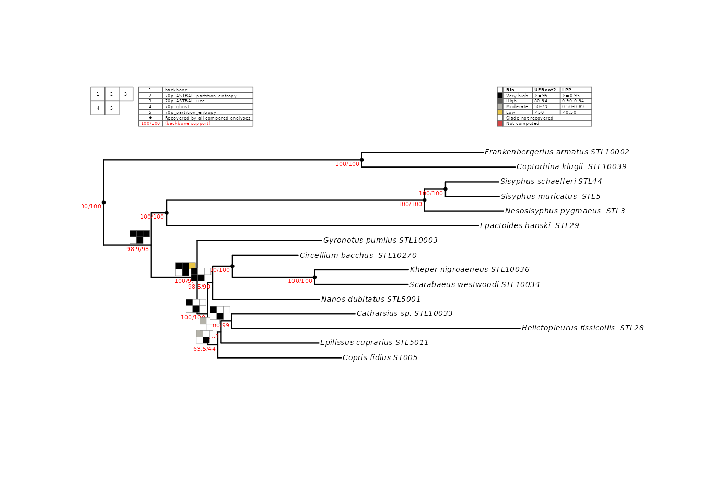

### Custom thresholds

Override the default support bins with your own cutoffs:

``` r

my_thresholds <- list(
  ufboot = c(very_high = 98, high = 90, moderate = 70),
  lpp    = c(very_high = 0.99, high = 0.90, moderate = 0.70)
)

plot_phylorug(
  backbone, npm,
  mode       = "support",
  thresholds = my_thresholds
)
```

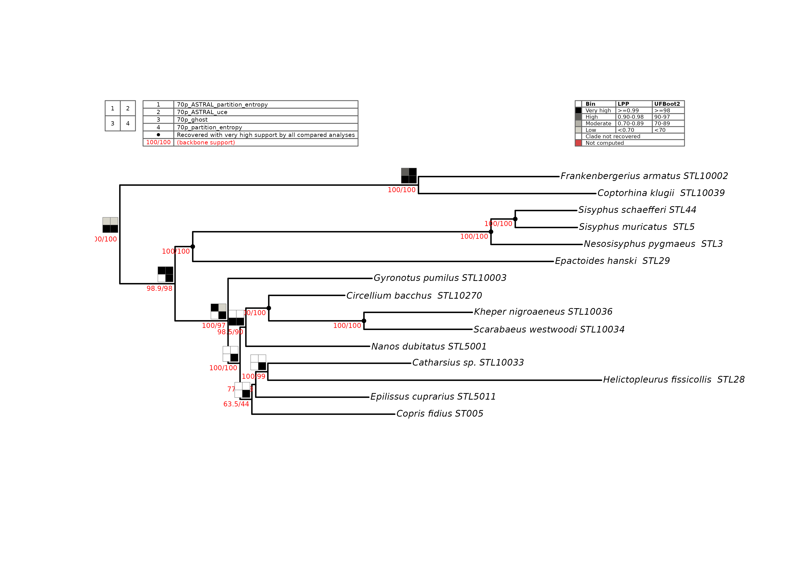

Each entry must name all three tiers (`very_high`, `high`, `moderate`);
anything else stops early with an error naming the missing tier. The
`very_high` cutoff also decides which nodes earn a dot in support mode:
lowering UFBoot2’s from 95 to 90, for example, lets a node keep its dot
when its only sub-threshold analysis scores 92.

### Selecting which nodes to visualize

Sometimes you only want to look at a few clades, not the whole tree.
`nodes` restricts the rug to just those, using the tip labels that
define each clade:

``` r

plot_phylorug(
  backbone, npm,
  mode = "support",
  nodes = list(
    c("Gyronotus_pumilus_STL10003", "Scarabaeus_westwoodi_STL10034"),
    c("Nanos_dubitatus_STL5001", "Catharsius_sp._STL10033")
  )
)
```

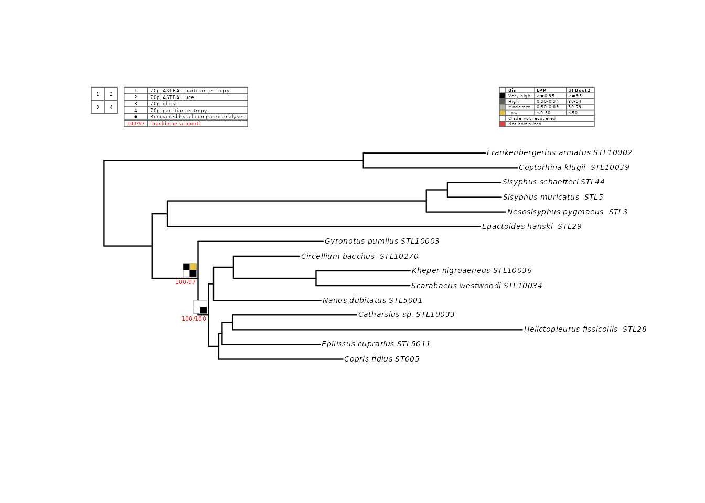

Only these two clades get a dot or rug, every other node is left bare.
If you already know the internal node ID, pass it directly as a numeric
vector instead:

``` r

plot_phylorug(backbone, npm, nodes = 18)
```

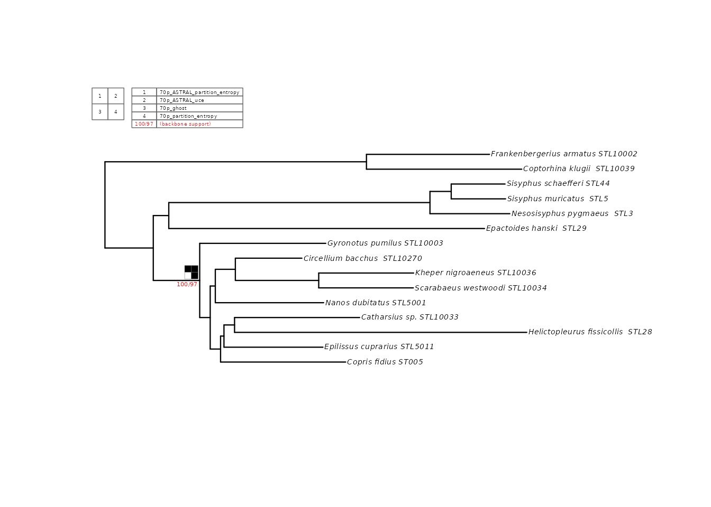

But how do you find the right node ID in the first place? To find the
nodes where analyses disagree,filter the presence matrix for rows with
at least one 0, then look up the tips at each one:

``` r

disagree_ids <- as.integer(rownames(npm$presence))[
  apply(npm$presence, 1, function(row) any(row == 0))
]
disagree_ids
#> [1] 17 18 19 20 21 22 23

lapply(disagree_ids, function(id) ape::extract.clade(backbone, id)$tip.label)
#> [[1]]
#>  [1] "Gyronotus_pumilus_STL10003"        "Epactoides_hanski__STL29"         
#>  [3] "Nesosisyphus_pygmaeus__STL3"       "Sisyphus_muricatus__STL5"         
#>  [5] "Sisyphus_schaefferi_STL44"         "Nanos_dubitatus_STL5001"          
#>  [7] "Scarabaeus_westwoodi_STL10034"     "Kheper_nigroaeneus_STL10036"      
#>  [9] "Circellium_bacchus__STL10270"      "Epilissus_cuprarius_STL5011"      
#> [11] "Helictopleurus_fissicollis__STL28" "Catharsius_sp._STL10033"          
#> [13] "Copris_fidius_ST005"              
#> 
#> [[2]]
#> [1] "Gyronotus_pumilus_STL10003"        "Nanos_dubitatus_STL5001"          
#> [3] "Scarabaeus_westwoodi_STL10034"     "Kheper_nigroaeneus_STL10036"      
#> [5] "Circellium_bacchus__STL10270"      "Epilissus_cuprarius_STL5011"      
#> [7] "Helictopleurus_fissicollis__STL28" "Catharsius_sp._STL10033"          
#> [9] "Copris_fidius_ST005"              
#> 
#> [[3]]
#> [1] "Nanos_dubitatus_STL5001"           "Scarabaeus_westwoodi_STL10034"    
#> [3] "Kheper_nigroaeneus_STL10036"       "Circellium_bacchus__STL10270"     
#> [5] "Epilissus_cuprarius_STL5011"       "Helictopleurus_fissicollis__STL28"
#> [7] "Catharsius_sp._STL10033"           "Copris_fidius_ST005"              
#> 
#> [[4]]
#> [1] "Epilissus_cuprarius_STL5011"       "Helictopleurus_fissicollis__STL28"
#> [3] "Catharsius_sp._STL10033"           "Copris_fidius_ST005"              
#> 
#> [[5]]
#> [1] "Epilissus_cuprarius_STL5011"       "Helictopleurus_fissicollis__STL28"
#> [3] "Catharsius_sp._STL10033"          
#> 
#> [[6]]
#> [1] "Helictopleurus_fissicollis__STL28" "Catharsius_sp._STL10033"          
#> 
#> [[7]]
#> [1] "Nanos_dubitatus_STL5001"       "Scarabaeus_westwoodi_STL10034"
#> [3] "Kheper_nigroaeneus_STL10036"   "Circellium_bacchus__STL10270"
```

That shows you exactly which taxa sit at each disagreeing node, so you
can pick the one you actually want to zoom in on with `nodes`, rather
than guessing from a bare number.

## Tips and best practices

**Root and prune before translating.**
[`translate_tips()`](https://mdrifathahamed.github.io/phylorug/reference/translate_tips.md)
replaces specimen codes with species names. Once translated, you cannot
match outgroup names for rooting. Always: (1) root, (2) drop outgroup,
(3) translate.

**One file = one analysis.**
[`read_trees()`](https://mdrifathahamed.github.io/phylorug/reference/read_trees.md)
treats each file as one analysis. A single-tree file returns a `phylo`;
a file with multiple equally optimal trees (as POY, TNT, or PAUP\* write
them) returns a `multiPhylo` scored as a pool.

**Pool scoring in presence mode.** By default (`pool_threshold = 1.0`),
a clade counts as present only if every tree in the pool recovers it
equivalent to a strict consensus. Set `pool_threshold = 0.5` for
majority rule, or `pool_threshold = 0` to record the raw proportion
(e.g., 2 out of 3 gives 0.67). A single-tree analysis always records 1
or 0.

**Support mode is not available for pools.** Node labels on tied optima
are not independent support values. Meaningful support (bootstrap,
posterior, SH-aLRT) comes only from explicit resampling or model-based
procedures. To visualize support for a parsimony analysis, compute it
externally (e.g., map bootstrap replicates onto the strict consensus,
per Simmons and Freudenstein 2011), save the summarized tree, and pass
that single file to phylorug. Passing raw tied optima into support mode
would display arbitrary node labels as though they were support values,
producing an artifactual rug.

**Use
[`prune_to_shared()`](https://mdrifathahamed.github.io/phylorug/reference/prune_to_shared.md)
when taxa differ.** If a comparison tree is missing some backbone taxa,
[`node_presence_matrix()`](https://mdrifathahamed.github.io/phylorug/reference/node_presence_matrix.md)
will refuse to proceed (a clade containing a missing taxon cannot be
evaluated). Run
[`check_taxa()`](https://mdrifathahamed.github.io/phylorug/reference/check_taxa.md)
first to see the discrepancies, then
[`prune_to_shared()`](https://mdrifathahamed.github.io/phylorug/reference/prune_to_shared.md)
to reduce all trees to their common taxa.

**A dot means different things in the two modes.** In presence mode it
means “recovered by every analysis”. In support mode it additionally
means “rated very-high by every analysis”. If you compare figures from
the two modes, read the legend’s dot row, which states the rule in
effect.

## References

- Fu, Y., Du, S., Fang, X., Xu, Z. & Wang, X. (2025). Phylogenomic
  insights into the higher level relationships within Culicomorpha
  (Diptera) revealed by whole-genome sequencing. *Insect Systematics and
  Diversity*, 9(6), ixaf056. <https://doi.org/10.1093/isd/ixaf056>
- Giribet, G. (2003). Stability in phylogenetic formulations and its
  relationship to nodal support. *Systematic Biology*, 52(4), 554–564.
  <https://doi.org/10.1080/10635150390223730>
- Machado, D.J. (2015). YBYRÁ facilitates comparison of large
  phylogenetic trees. *BMC Bioinformatics*, 16, 204.
  <https://doi.org/10.1186/s12859-015-0642-9>
- Montanaro, G., Lopes, F., Gunter, N.L., Scholtz, C., Davis, A.L.,
  Losacco, F., Rossini, M., Gillett, C.P.D.T., Saxton, N.A., Stone,
  R.L., Daniel, G.M. & Tarasov, S. (2026). Phylogenomics resolves a
  200-year-old puzzle: a revised tribal classification of Afro-Eurasian
  dung beetles (Coleoptera: Scarabaeinae). *bioRxiv*.
  <https://doi.org/10.64898/2026.07.22.740134>
- Simmons, M.P. & Freudenstein, J.V. (2011). Spurious 99% bootstrap and
  jackknife support for unsupported clades. *Molecular Phylogenetics and
  Evolution*, 61(1), 177–191.
  <https://doi.org/10.1016/j.ympev.2011.06.003>
- Sanders, J.G. (2010). Program note: Cladescan, a program for automated
  phylogenetic sensitivity analysis. *Cladistics*, 26(1), 114–116.
  <https://doi.org/10.1111/j.1096-0031.2009.00280.x>
- Steenwyk, J.L., Li, Y., Zhou, X., Shen, X.X. & Rokas, A. (2023).
  Incongruence in the phylogenomics era. *Nature Reviews Genetics*,
  24(12), 834–850. <https://doi.org/10.1038/s41576-023-00620-x>
- Wheeler, W.C. (1995). Sequence alignment, parameter sensitivity, and
  the phylogenetic analysis of molecular data. *Systematic Biology*,
  44(3), 321–331. <https://doi.org/10.2307/2413595>
