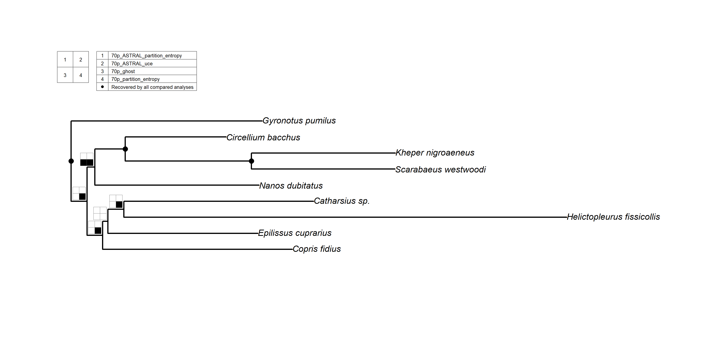
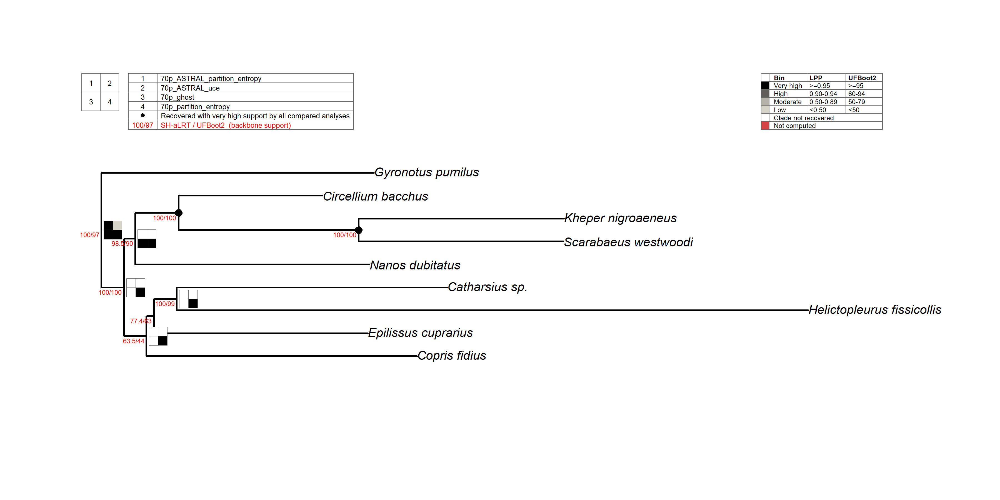

# phylorug

**phylorug** is an R package for comparing and visualizing clade
recovery and support across phylogenetic trees. It takes a set of trees
from different inference pipelines, datasets, or statistical models, all
representing the same focal group of organisms. It draws a compact
coloured grid, a **rug plot**, at each internal node of a reference
tree, showing which clades are stable across trees and which are not. In
presence mode, nodes recovered by all comparison trees appear as solid
dots; in support mode, a dot means every comparison tree also rates the
clade as very-high support. Contested or mixed-support nodes get a full
**rug plot** showing each analysis individually.

## Overview

Phylogenomic studies routinely apply multiple analytical approaches to
infer relationships within a focal group of organisms. Different
inference methods, datasets, and models yield trees that may differ in
topology and report clade support using different metrics and formats.
Assessing the robustness of phylogenetic results therefore requires
comparing clade recovery and support across analyses, typically relative
to a selected backbone tree.

A convenient way to visualize such comparisons is a phylogenetic **rug
plot**, in which each node of the backbone tree is associated with a
series of cells representing different analyses. Each cell indicates
whether a clade was recovered and, where applicable, its level of
support. **Rug plots** give an intuitive overview of clade stability
across alternative phylogenetic analyses, but compiling them manually is
tedious and time-consuming. Despite the extensive use of R in the
phylogenetics community, no dedicated R package exists for generating
such plots.

**phylorug** fills this gap. It operates in two modes:

## Presence mode



Black/white cells showing whether each analysis recovered a given clade
or not. Stable nodes appear as black dots; contested nodes show a **rug
plot**.

## Support mode



Cells are shaded in greyscale by how strongly each analysis supports a
given clade, from black (very high) through progressively lighter greys
to the lightest (low). White means the clade was not recovered; red
means it was recovered but carries no support value. Each support value
is binned against its own metric’s thresholds, UFBoot2 95 and LPP 0.95
are never treated as equivalent. Default thresholds are provided, but
users are encouraged to set their own.

In support mode a dot is stricter than in presence mode: it appears only
where every comparison analysis recovers the clade *and* rates it
very-high support. A clade recovered everywhere but with weaker or
missing support in even one analysis is drawn as a full **rug plot**
instead. Set `dot_on_very_high = FALSE` to draw a grid at every node.

*Figures show a 9-taxon subset of `sample_trees` (tip labels cleaned)
for readability.*

The entire workflow runs in R, from reading raw tree files to
publication-ready figures. The package was developed around a dung
beetle phylogenomic dataset (Montanaro, Lopes et al. 2026) and includes
three bundled datasets so users can try the pipeline on real data before
applying it to their own.

### Installation

**phylorug** is not yet on CRAN. To install the development version from
GitHub:

``` r

# install.packages("pak")
pak::pak("mdrifathahamed/phylorug")
# or
devtools::install_github("mdrifathahamed/phylorug")
library(phylorug)
```

### Quick example

``` r

library(phylorug)

# Load example trees from the package data
data(sample_trees)

# Select backbone and comparison trees
backbone <- sample_trees[["70p_uce"]]
others   <- sample_trees[names(sample_trees) != "70p_uce"]

# Validate  all trees share same set of taxa (recommended but optional)
check_taxa(backbone, others)

# Build the node presence matrix
# support_type only matters for support mode — skip it if you just want 
# presence/absence
npm <- node_presence_matrix(backbone, others, support_col = 1, support_type = c(
                "70p_ASTRAL_partition_entropy" = "lpp",
                "70p_ASTRAL_uce"               = "lpp",
                "70p_ghost"                    = "ufboot",
                "70p_partition_entropy"        = "ufboot"))

# Presence mode: Which analyses recover each clade?
plot_phylorug(backbone, npm)

# Support mode: How strongly?
plot_phylorug(backbone, npm, mode = "support")
```

### Core functions

**phylorug** provides seven functions that cover the full workflow from
raw tree files to publication-ready figures:

- [`read_trees()`](https://mdrifathahamed.github.io/phylorug/reference/read_trees.md)
  reads all Newick and Nexus tree files from a directory. So you don’t
  need to load each file individually.
- [`node_presence_matrix()`](https://mdrifathahamed.github.io/phylorug/reference/node_presence_matrix.md)
  builds the comparison matrix recording which clades are recovered by
  which analyses, along with their support values.
- [`plot_phylorug()`](https://mdrifathahamed.github.io/phylorug/reference/plot_phylorug.md)
  draws the rug plot on a reference tree.

That is the basic pipeline: read -\> matrix -\> plot. Four additional
helpers are available when your data needs them:

- [`check_taxa()`](https://mdrifathahamed.github.io/phylorug/reference/check_taxa.md)
  Validates that the backbone and comparison trees share an identical
  set of taxa, reporting any missing or extraneous tips. Use this
  diagnostic function between
  [`read_trees()`](https://mdrifathahamed.github.io/phylorug/reference/read_trees.md)
  and
  [`node_presence_matrix()`](https://mdrifathahamed.github.io/phylorug/reference/node_presence_matrix.md)
  to pinpoint exact tip mismatches before the pipeline halts.

- [`translate_tips()`](https://mdrifathahamed.github.io/phylorug/reference/translate_tips.md)
  Rename tip labels between naming conventions using a lookup table
  (e.g. specimen codes to species names).

- [`prune_to_shared()`](https://mdrifathahamed.github.io/phylorug/reference/prune_to_shared.md)
  drops taxa that are not present in all trees, keeping only the shared
  set. Useful when comparison trees lack some taxa found in the
  backbone.

- [`add_tree()`](https://mdrifathahamed.github.io/phylorug/reference/add_tree.md)
  Appends new comparison trees directly to an existing node presence
  matrix (the object generated by
  [`node_presence_matrix()`](https://mdrifathahamed.github.io/phylorug/reference/node_presence_matrix.md))
  without requiring a complete recalculation of the pipeline.

You can learn more about each step in
[`vignette("phylorug")`](https://mdrifathahamed.github.io/phylorug/articles/phylorug.md).

### Dependencies

**phylorug** depends on [ape](https://cran.r-project.org/package=ape)
and [phangorn](https://cran.r-project.org/package=phangorn). No other
external dependencies are required.

### Additional features

- Handles compound IQ-TREE labels (e.g. `SH-aLRT/UFBoot2`). User selects
  which slot to extract via `support_col` in
  [`node_presence_matrix()`](https://mdrifathahamed.github.io/phylorug/reference/node_presence_matrix.md),
  and controls what appears on the tree via `show_support_idx` in
  [`plot_phylorug()`](https://mdrifathahamed.github.io/phylorug/reference/plot_phylorug.md)
- Treats a bare `"multiPhylo"` as one analysis (a pool of tied-optimal
  trees). Whether a clade counts as present depends on `pool_threshold`:
  `1.0` (default) requires all pool trees to recover it (strict
  consensus), `0.5` requires a majority.
- Supports both `"inside"` and `"outside"` rug positioning relative to
  the tree
- Backbone support values can be displayed alongside rug cells via
  `show_support`
- Unanimous nodes are collapsed to dots by default. In presence mode,
  `dot_identical = FALSE` shows rug plots on every node. In support
  mode, `dot_on_very_high = FALSE` does the same, revealing support
  variation even at unanimous nodes
- *phylorug* draws rug plot visualizations directly on the nodes of a
  reference phylogenetic tree, and lets users choose which nodes to
  visualize.
- Saves directly to PDF, PNG, or JPEG via the `file` argument.

### Getting help

An overview of the package:
[`?phylorug`](https://mdrifathahamed.github.io/phylorug/reference/phylorug-package.md)

If you find a bug or have a feature request, please open an issue on
[GitHub](https://github.com/mdrifathahamed/phylorug/issues).

### Citation

If you use **phylorug** in a publication, please cite:

> Ahamed, M.R., Arias, J.S., and Tarasov, S. (2026). phylorug: Visualize
> Clade Recovery and Support Across Phylogenetic Trees. R package
> version 0.1.0. <https://github.com/mdrifathahamed/phylorug>

### Acknowledgements

This package was developed at the Finnish Museum of Natural History
(LUOMUS) (<https://www.helsinki.fi/en/luomus>), University of Helsinki,
as part of an MSc thesis in Ecology and Evolutionary Biology under the
supervision of Sergei Tarasov and J. Salvador Arias.

The rug-plot concept traces to Wheeler (1995), was named “Navajo rugs”
by Giribet (2003), and automated by Sanders (2010, Cladescan) and
Machado (2015, YBYRÁ). **phylorug** extends this lineage into R and
beyond parameter sensitivity to modern phylogenomic workflows.
